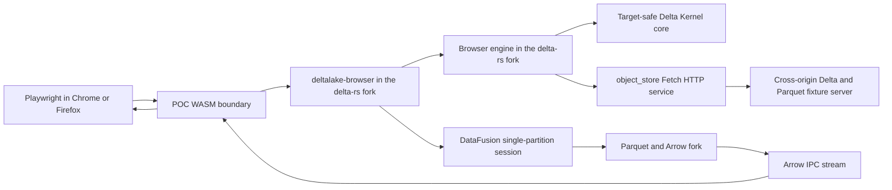
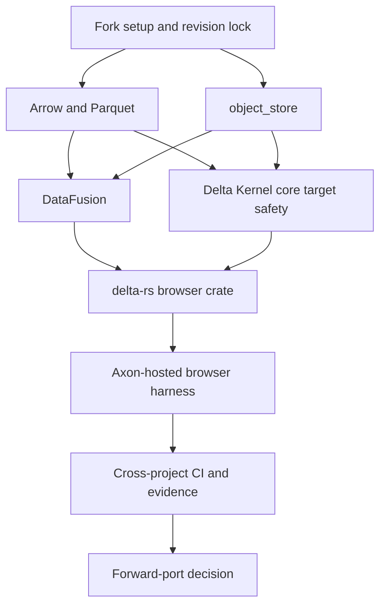

# Daxis Upstream WASM Fork POC Implementation Plan

> **For Claude:** REQUIRED SUB-SKILL: Use superpowers:executing-plans to implement this plan
> task-by-task.

**Goal:** Prove that a real browser can use revision-pinned Daxis forks of Arrow Rust, Parquet,
`object_store`, DataFusion, delta-kernel, and delta-rs to read a Delta table over cross-origin HTTP
ranges, execute SQL, and return Arrow IPC without native dependencies or downstream codec
suppression.

**Architecture:** Build a release-compatible POC lane from the versions in Axon's lockfile. Keep
upstreamable changes separate from Daxis revision-wiring commits in each fork. Run the complete stack
from a nested, test-only Axon workspace that consumes one pinned delta-rs browser crate and leaves
Axon's shipping dependency graph unchanged. Forward-port the proven changes to current canonical
branches after the POC passes.

**Tech Stack:** Rust, Cargo resolver v2 and v3, `wasm32-unknown-unknown`, wasm-bindgen, `wasm-pack`,
Playwright, Chrome, Firefox, Fetch, HTTP Range and validators, Arrow IPC, Parquet, `object_store`,
DataFusion, Delta Kernel, delta-rs, GitHub forks, and GitHub Actions.

---

- Status: Proposed
- Date: 2026-07-23
- Organization: `daxis-io`
- Execution owner: Runtime / engine team
- Upstream owner: DX / OSS maintainer
- Related:
  - [Upstream WASM Support Strategy](../program/upstream-wasm-support-strategy.md)
  - [Upstream WASM Support Design Pack](../research/upstream-wasm-support-design-pack/README.md)
  - [Upstream WASM Support Implementation Plan](./2026-07-23-upstream-wasm-support-implementation-plan.md)
  - [ADR-0006: Upstream-First Fork Policy](../adr/ADR-0006-upstream-first-fork-policy-and-version-cadence.md)
  - [Upstream Patch Inventory](../program/upstream-patch-inventory.md)

## POC Result

The POC produces one reproducible browser run with this path:



The happy-path fixture contains one checkpoint-free Delta table and one Snappy or uncompressed
Parquet data file. The browser runs:

```sql
SELECT category, SUM(amount) AS total
FROM items
WHERE active = true
GROUP BY category
ORDER BY category
```

The expected rows are:

```text
A,25
B,20
```

A second fixture uses zstd pages. The browser must inspect its Delta log and Parquet schema, then
return the documented target-unavailable zstd error when the query requests compressed page data.

## Approach Decision

### Selected: compatible POC lane plus clean forward ports

Axon's lockfile contains Arrow `58.3.0`, DataFusion `53.1.0`, `object_store` `0.13.2`, delta-rs
`0.32.4`, and `buoyant_kernel` `0.22.2`. The POC forks start from those releases. Each repository
keeps two classes of commit:

- Candidate commits contain target gates, browser services, errors, and tests that can move
  upstream.
- Stack commits contain Daxis git revisions and POC workflow wiring. They stay in Daxis forks.

Once the browser proof passes, the team rebases or reapplies candidate commits to current canonical
`main`. This keeps version upgrades outside the first debugging loop.

### Rejected: build the first POC from all current upstream mains

The current canonical branches do not form the dependency set that Axon consumes. At the planning
snapshot, Arrow and DataFusion use `59.1.0` and `54.1.0`, `object_store` main uses `0.14.1`, while
delta-rs and Axon still depend on older compatible versions. Starting from all main branches would
mix the WASM work with Arrow, DataFusion, kernel, and `object_store` upgrades.

### Rejected: vendor or patch source inside Axon

Vendoring would prove that Axon can carry private source. It would not prove that each owning crate
has a reviewable fix or that an external consumer can reproduce the graph. The POC harness may use
git revisions, but the implementation stays in the corresponding Daxis fork.

## Planning Snapshot

### Daxis fork inventory

The following state was verified through the GitHub API on 2026-07-23:

| Repository                                      | State     | POC use                                                                 |
| ----------------------------------------------- | --------- | ----------------------------------------------------------------------- |
| `daxis-io/arrow-rs`                             | Absent    | Create as a fork of `apache/arrow-rs`.                                  |
| `daxis-io/arrow-rs-object-store`                | Absent    | Create as a fork of `apache/arrow-rs-object-store`.                     |
| `daxis-io/datafusion`                           | Absent    | Create as a fork of `apache/datafusion`.                                |
| `daxis-io/delta-kernel-rs`                      | Exists    | Reuse. Create POC branches without rewriting its `main`.                |
| `daxis-io/delta-rs`                             | Absent    | Create as a fork of `delta-io/delta-rs`.                                |
| `daxis-io/datafusion-wasm-bindings`             | Exists    | Keep as comparison material. It does not replace the DataFusion fork.   |
| Authenticated `daxis-io` organization role      | `admin`   | Sufficient for fork and branch setup. Recheck before external mutation. |
| Existing `daxis-io/delta-kernel-rs` `main` head | `7bfb065` | Treat as unrelated history. Do not fast-forward or force-push it.       |

### Compatible POC bases

| Component      | Canonical source               | Base ref               | Peeled commit                              | Consumed version        |
| -------------- | ------------------------------ | ---------------------- | ------------------------------------------ | ----------------------- |
| Arrow/Parquet  | `apache/arrow-rs`              | `58.3.0`               | `913bab26ba9bed8fc2bc1acda300cc52345b0da1` | `58.3.0`                |
| `object_store` | `apache/arrow-rs-object-store` | `v0.13.2`              | `7a65b75b0d26fd8a282999462cb7030fb85fdcc3` | `0.13.2`                |
| DataFusion     | `apache/datafusion`            | `53.1.0`               | `eae7bf4fa1c037c0a065d1f36d0669f5bb97a9cf` | `53.1.0`                |
| Delta Kernel   | `buoyant-data/delta-kernel-rs` | `buoyant-v0.22.2`      | `f4602a43fe886f45cc3523360bc2488b8f3a2e58` | `buoyant_kernel 0.22.2` |
| delta-rs       | `delta-io/delta-rs`            | `rust-v0.32.4`         | `df72cc6d3fba014a77243ce80514a6122b46a89b` | `deltalake 0.32.4`      |
| Axon harness   | `daxis-io/axon`                | `origin/main` snapshot | `62d4c465e10dc329221023eaaf2c67c542c408ce` | Workspace lock          |

The Buoyant base is a compatibility input because delta-rs `0.32.4` consumes
`buoyant_kernel 0.22.2`. The Daxis repository remains a GitHub fork of `delta-io/delta-kernel-rs`.
The team fetches the Buoyant tag into a POC branch and leaves the fork's default branch untouched.

### Forward-port bases at planning time

These commits record the newer canonical state. Re-fetch them before forward-port work:

| Component      | Canonical `main` commit                    |
| -------------- | ------------------------------------------ |
| Arrow/Parquet  | `a5158c8bf926bd74a01093a05187d25b2dfc1bc3` |
| `object_store` | `84d24eb8efcec9448566de09e94d2d4b74b21ebe` |
| DataFusion     | `abc226e6c637cdb00012e8e6cd5884a60ae23f3e` |
| Delta Kernel   | `8547538d22d23a532cd07f31f3b9ec1e379bd750` |
| delta-rs       | `3f562682c5a9dd55693b7f7bbd2a2f749fdf38e5` |

## Branch And Revision Policy

Each fork uses these branch roles:

| Branch pattern                 | Purpose                                                                 |
| ------------------------------ | ----------------------------------------------------------------------- |
| `poc/base/<release>`           | Immutable review base at the compatible release commit.                 |
| `poc/wasm32-browser-candidate` | Code and tests that may move upstream.                                  |
| `poc/wasm32-browser-stack`     | Candidate branch plus Daxis revision pins and POC workflow changes.     |
| `upstream/wasm32-<concern>`    | Clean forward port from canonical `main`, created after the POC passes. |

Rules:

- Do not merge a POC release branch into a fork's default branch.
- Do not force-push a revision once another repository records it.
- Use 40-character `rev` values in Cargo manifests. Do not use branch dependencies.
- Put direct `git` plus `rev` sources in each stack branch's workspace dependencies. Cargo ignores a
  dependency repository's `[patch]` table when another workspace consumes it.
- Record the candidate and stack revision for each fork.
- Open Daxis draft PRs from candidate branches against their matching `poc/base/*` branch.
- Open upstream PRs from clean forward-port branches without Daxis URLs or Axon types.
- Sign candidate commits with `git commit -s`.
- Put each Daxis-only wiring commit after the last candidate commit.
- Require native and locally owned checks on candidate branches. Require the complete WASM graph on
  stack branches, where downstream fork revisions are available.

## POC Scope

### Included

- Exact `wasm32-unknown-unknown` target gates.
- Native defaults and native codec regression tests.
- Feature-unified Parquet and Arrow IPC zstd builds.
- Explicit target-unavailable codec errors.
- `object_store` Fetch HTTP reads, retry sleep, Range validation, ETag, and `If-Range`.
- DataFusion in-memory execution with one target partition and disk disabled.
- Delta Kernel read-only log and Parquet services.
- A separate delta-rs browser crate.
- Chrome and Firefox browser tests against a second origin.
- Locked source revisions, dependency graph policy, bundle-size reporting, and evidence capture.

### Deferred

- Multipart upload and all write operations.
- Browser cloud credential discovery and provider-specific builders.
- Filesystem, spill, worker threads, and multi-partition execution.
- Pure-Rust zstd decode or encode.
- General codec-provider APIs.
- Production Axon dependency replacement.
- Publishing crates or merging canonical upstream PRs.

## Acceptance Gates

| Gate                    | Pass condition                                                                                                        |
| ----------------------- | --------------------------------------------------------------------------------------------------------------------- |
| Native compatibility    | Each fork's native default tests pass from its compatible base.                                                       |
| Graph compile           | The locked stack compiles for `wasm32-unknown-unknown` without Clang or global `getrandom` flags.                     |
| Feature unification     | A consumer enables dependency defaults plus zstd and HTTP; the WASM graph still compiles.                             |
| Graph policy            | The active browser closure omits `zstd-sys`, `liblzma-sys`, `aws-lc-sys`, `openssl-sys`, `native-tls`, and native FS. |
| Codec behavior          | Supported codecs read data; zstd feature-on builds and returns a target-unavailable error when page decode starts.    |
| Browser HTTP            | Chrome and Firefox pass cross-origin Range, validator, retry, and unexpected `200` tests.                             |
| Delta semantics         | Delta Kernel resolves the fixed checkpoint-free snapshot and returns the expected active file.                        |
| Query execution         | DataFusion returns `A,25` and `B,20` and produces a valid Arrow IPC stream.                                           |
| Axon boundary           | The test harness carries the IPC bytes and metrics across the same browser-facing result boundary used by Axon.       |
| Reproducibility         | A clean checkout can rebuild from `stack.lock.toml` and the committed Cargo lock without mutable branch references.   |
| Evidence classification | The report labels graph, browser runtime, protocol, and downstream integration results as separate claims.            |

Functional POC success does not imply that every DataFusion plan, Delta operation, codec, or cloud
provider works in browsers.

## Execution Order



Arrow/Parquet and `object_store` can proceed as separate work streams. DataFusion and Delta Kernel
must pin the leaf fork revisions before their stack branches become immutable.

## Execution Rules

- Start from isolated clones and an Axon worktree based on `origin/main`.
- Use `cfg(all(target_arch = "wasm32", target_os = "unknown"))` for the scoped target.
- Re-run each baseline failure before changing production code.
- Keep fixture and production fix in the same green PR.
- Use test-first commit boundaries.
- Preserve the native public feature composition.
- Keep Daxis URLs out of candidate commits when a later stack commit can carry them.
- Update `stack.lock.toml` after each pushed immutable revision.
- Run `cargo tree -d` after each dependency wiring change.
- Stop if Cargo resolves two Arrow, Parquet, `object_store`, DataFusion, or kernel type universes in
  the browser harness.
- Stop if a proposed fix requires changing an existing public native error type for POC plumbing.
- Do not add secrets to fork workflows. The browser fixture server uses public test data.

## Task 1: Create The Daxis Fork Control Plane

**Repositories:**

- `daxis-io/axon`
- `daxis-io/arrow-rs`
- `daxis-io/arrow-rs-object-store`
- `daxis-io/datafusion`
- `daxis-io/delta-kernel-rs`
- `daxis-io/delta-rs`

**Files:**

- Modify: `docs/program/upstream-patch-inventory.md`
- Create: `docs/release-gates/upstream-wasm-fork-poc-evidence.md`

**Step 1: Recheck organization and fork state**

Run:

```bash
gh auth status
gh api user/memberships/orgs/daxis-io --jq '{state,role}'
gh repo list daxis-io --limit 200 \
  --json name,nameWithOwner,url,isFork,parent,defaultBranchRef
```

Expected: active organization membership with permission to create repositories. Stop if any target
fork now exists with an unexpected parent or unrelated owner policy.

**Step 2: Create the four missing forks**

Run each command only when `gh repo view` confirms the target is absent:

```bash
gh repo fork apache/arrow-rs \
  --org daxis-io \
  --fork-name arrow-rs \
  --default-branch-only

gh repo fork apache/arrow-rs-object-store \
  --org daxis-io \
  --fork-name arrow-rs-object-store \
  --default-branch-only

gh repo fork apache/datafusion \
  --org daxis-io \
  --fork-name datafusion \
  --default-branch-only

gh repo fork delta-io/delta-rs \
  --org daxis-io \
  --fork-name delta-rs \
  --default-branch-only
```

Do not recreate `daxis-io/delta-kernel-rs`.

**Step 3: Create isolated clones and the Axon worktree**

From the Axon root:

```bash
git check-ignore -q .worktrees
export WASM_POC_ROOT="/Users/ethanurbanski/axon/.worktrees/upstream-wasm-fork-poc"
mkdir -p "$WASM_POC_ROOT"

git clone https://github.com/daxis-io/arrow-rs.git "$WASM_POC_ROOT/arrow-rs"
git clone https://github.com/daxis-io/arrow-rs-object-store.git "$WASM_POC_ROOT/object-store"
git clone https://github.com/daxis-io/datafusion.git "$WASM_POC_ROOT/datafusion"
git clone https://github.com/daxis-io/delta-kernel-rs.git "$WASM_POC_ROOT/delta-kernel-rs"
git clone https://github.com/daxis-io/delta-rs.git "$WASM_POC_ROOT/delta-rs"
git worktree add "$WASM_POC_ROOT/axon" \
  -b poc/upstream-wasm-fork-stack \
  origin/main
```

Add canonical remotes:

```bash
git -C "$WASM_POC_ROOT/arrow-rs" remote add upstream https://github.com/apache/arrow-rs.git
git -C "$WASM_POC_ROOT/object-store" remote add upstream https://github.com/apache/arrow-rs-object-store.git
git -C "$WASM_POC_ROOT/datafusion" remote add upstream https://github.com/apache/datafusion.git
git -C "$WASM_POC_ROOT/delta-kernel-rs" remote add upstream https://github.com/delta-io/delta-kernel-rs.git
git -C "$WASM_POC_ROOT/delta-kernel-rs" remote add buoyant https://github.com/buoyant-data/delta-kernel-rs.git
git -C "$WASM_POC_ROOT/delta-rs" remote add upstream https://github.com/delta-io/delta-rs.git
```

**Step 4: Push immutable review-base branches**

Fetch the tags and create:

```text
daxis-io/arrow-rs                     poc/base/arrow-58.3.0
daxis-io/arrow-rs-object-store        poc/base/object-store-0.13.2
daxis-io/datafusion                   poc/base/datafusion-53.1.0
daxis-io/delta-kernel-rs              poc/base/buoyant-kernel-0.22.2
daxis-io/delta-rs                     poc/base/delta-rs-0.32.4
```

Run:

```bash
git -C "$WASM_POC_ROOT/arrow-rs" fetch upstream tag 58.3.0
git -C "$WASM_POC_ROOT/arrow-rs" switch \
  -c poc/base/arrow-58.3.0 \
  913bab26ba9bed8fc2bc1acda300cc52345b0da1
git -C "$WASM_POC_ROOT/arrow-rs" push -u origin poc/base/arrow-58.3.0
git -C "$WASM_POC_ROOT/arrow-rs" switch -c poc/wasm32-browser-candidate

git -C "$WASM_POC_ROOT/object-store" fetch upstream tag v0.13.2
git -C "$WASM_POC_ROOT/object-store" switch \
  -c poc/base/object-store-0.13.2 \
  7a65b75b0d26fd8a282999462cb7030fb85fdcc3
git -C "$WASM_POC_ROOT/object-store" push -u origin poc/base/object-store-0.13.2
git -C "$WASM_POC_ROOT/object-store" switch -c poc/wasm32-browser-candidate

git -C "$WASM_POC_ROOT/datafusion" fetch upstream tag 53.1.0
git -C "$WASM_POC_ROOT/datafusion" switch \
  -c poc/base/datafusion-53.1.0 \
  eae7bf4fa1c037c0a065d1f36d0669f5bb97a9cf
git -C "$WASM_POC_ROOT/datafusion" push -u origin poc/base/datafusion-53.1.0
git -C "$WASM_POC_ROOT/datafusion" switch -c poc/wasm32-browser-candidate

git -C "$WASM_POC_ROOT/delta-kernel-rs" fetch buoyant tag buoyant-v0.22.2
git -C "$WASM_POC_ROOT/delta-kernel-rs" switch \
  -c poc/base/buoyant-kernel-0.22.2 \
  f4602a43fe886f45cc3523360bc2488b8f3a2e58
git -C "$WASM_POC_ROOT/delta-kernel-rs" push -u origin poc/base/buoyant-kernel-0.22.2
git -C "$WASM_POC_ROOT/delta-kernel-rs" switch -c poc/wasm32-browser-candidate

git -C "$WASM_POC_ROOT/delta-rs" fetch upstream tag rust-v0.32.4
git -C "$WASM_POC_ROOT/delta-rs" switch \
  -c poc/base/delta-rs-0.32.4 \
  df72cc6d3fba014a77243ce80514a6122b46a89b
git -C "$WASM_POC_ROOT/delta-rs" push -u origin poc/base/delta-rs-0.32.4
git -C "$WASM_POC_ROOT/delta-rs" switch -c poc/wasm32-browser-candidate
```

Verify each branch resolves to the commit in the compatible-base table. Do not move a base branch
after publishing it.

**Step 5: Open one Axon umbrella issue**

Create an issue that links this plan, the architecture pack, all Daxis fork PRs, and later canonical
issues or PRs. Apply the repository's existing documentation and Rust labels rather than inventing a
new label vocabulary.

**Step 6: Add patch inventory rows**

Add one row per fork with:

- owner;
- candidate and stack branch;
- upstream disposition `proposed`;
- removal condition;
- umbrella issue.

The inventory must distinguish code intended upstream from Daxis-only dependency pins.

**Step 7: Commit the control-plane records**

```bash
git add docs/program/upstream-patch-inventory.md \
  docs/release-gates/upstream-wasm-fork-poc-evidence.md
git commit -m "docs: track the upstream wasm fork poc"
```

## Task 2: Add The Immutable Stack Lock And Verifier

**Repository:** `daxis-io/axon`

**Files:**

- Create: `poc/upstream-wasm-fork-stack/stack.lock.toml`
- Create: `tests/conformance/verify_upstream_wasm_fork_stack.sh`
- Create: `tests/conformance/verify_upstream_wasm_fork_stack_test.sh`
- Modify: `tests/conformance/README.md`

**Step 1: Write the failing verifier tests**

Cover:

- missing repository entry;
- non-40-character revision;
- `UNSET` candidate or stack revision;
- unreachable git revision;
- mutable `branch =` dependency;
- mismatched Cargo lock source;
- duplicate Arrow or DataFusion source.

Run:

```bash
bash tests/conformance/verify_upstream_wasm_fork_stack_test.sh
```

Expected: failure because the verifier does not exist.

**Step 2: Add the stack lock**

Start with:

```toml
schema = 1
target = "wasm32-unknown-unknown"
axon_base_rev = "62d4c465e10dc329221023eaaf2c67c542c408ce"

[repositories.arrow_rs]
canonical = "https://github.com/apache/arrow-rs"
fork = "https://github.com/daxis-io/arrow-rs"
base_rev = "913bab26ba9bed8fc2bc1acda300cc52345b0da1"
candidate_rev = "UNSET"
stack_rev = "UNSET"

[repositories.object_store]
canonical = "https://github.com/apache/arrow-rs-object-store"
fork = "https://github.com/daxis-io/arrow-rs-object-store"
base_rev = "7a65b75b0d26fd8a282999462cb7030fb85fdcc3"
candidate_rev = "UNSET"
stack_rev = "UNSET"

[repositories.datafusion]
canonical = "https://github.com/apache/datafusion"
fork = "https://github.com/daxis-io/datafusion"
base_rev = "eae7bf4fa1c037c0a065d1f36d0669f5bb97a9cf"
candidate_rev = "UNSET"
stack_rev = "UNSET"

[repositories.delta_kernel]
canonical = "https://github.com/delta-io/delta-kernel-rs"
compatibility_source = "https://github.com/buoyant-data/delta-kernel-rs"
fork = "https://github.com/daxis-io/delta-kernel-rs"
base_rev = "f4602a43fe886f45cc3523360bc2488b8f3a2e58"
candidate_rev = "UNSET"
stack_rev = "UNSET"

[repositories.delta_rs]
canonical = "https://github.com/delta-io/delta-rs"
fork = "https://github.com/daxis-io/delta-rs"
base_rev = "df72cc6d3fba014a77243ce80514a6122b46a89b"
candidate_rev = "UNSET"
stack_rev = "UNSET"
```

The verifier may accept `UNSET` while leaf work is in progress. The final browser gate rejects it.

**Step 3: Implement verification**

The script must:

1. parse each revision;
2. fetch the named commit from its fork;
3. scan POC Cargo manifests for branch dependencies;
4. inspect the target-filtered normal and build closure;
5. reject duplicate package/source pairs for Arrow, Parquet, `object_store`, DataFusion, and the
   kernel;
6. compare Cargo.lock git sources with `stack.lock.toml`.

**Step 4: Run the tests**

```bash
bash tests/conformance/verify_upstream_wasm_fork_stack_test.sh
bash tests/conformance/verify_upstream_wasm_fork_stack.sh --allow-unset
```

Expected: both pass.

**Step 5: Commit**

```bash
git add poc/upstream-wasm-fork-stack/stack.lock.toml \
  tests/conformance/verify_upstream_wasm_fork_stack.sh \
  tests/conformance/verify_upstream_wasm_fork_stack_test.sh \
  tests/conformance/README.md
git commit -m "test: lock the upstream wasm fork stack"
```

## Task 3: Implement Arrow And Parquet Target-Safe Codecs

**Repository:** `daxis-io/arrow-rs`

**Branch base:** `poc/base/arrow-58.3.0`

**Candidate branch:** `poc/wasm32-browser-candidate`

**Files:**

- Modify: `parquet/Cargo.toml`
- Modify: `parquet/src/compression.rs`
- Create: `parquet/tests/wasm_codec_availability.rs`
- Modify: `arrow-ipc/Cargo.toml`
- Modify: `arrow-ipc/src/compression.rs`
- Modify: `arrow-ipc/src/reader.rs`
- Modify: `arrow-ipc/src/writer.rs`
- Create: `arrow-ipc/tests/wasm_codec_availability.rs`
- Create: `dev/check_wasm_dependency_policy.sh`
- Modify: `.github/workflows/parquet.yml`
- Modify: `.github/workflows/arrow.yml`

**Step 1: Reproduce both failures**

Run:

```bash
cargo check -p parquet \
  --target wasm32-unknown-unknown \
  --no-default-features \
  --features arrow,async,object_store,snap,brotli,flate2-zlib-rs,lz4,zstd,base64,simdutf8 \
  --locked

cargo check -p arrow-ipc \
  --target wasm32-unknown-unknown \
  --no-default-features \
  --features lz4,zstd \
  --locked
```

Record the target-filtered paths to `zstd-sys`.

**Step 2: Write the three-state tests**

Add tests for:

| State                                      | Expected result                                      |
| ------------------------------------------ | ---------------------------------------------------- |
| `zstd` disabled                            | Existing feature-disabled error.                     |
| `zstd` enabled on native                   | Functional codec round trip.                         |
| `zstd` enabled on `wasm32-unknown-unknown` | Target-unavailable error with codec and target name. |

Add Parquet tests that read the footer and schema before compressed page decode. Add Arrow IPC tests
that parse the schema message before the compressed record batch.

**Step 3: Implement the Parquet fix**

Move the optional native `zstd` dependency under the inverse exact target cfg. Keep the logical
feature and native defaults unchanged. Apply backend availability to every
`#[cfg(any(feature = "zstd", test))]` branch.

Commit:

```bash
git add parquet dev/check_wasm_dependency_policy.sh .github/workflows/parquet.yml
git commit -s -m "Support feature-unified Parquet codecs on wasm32"
```

**Step 4: Implement the Arrow IPC fix**

Apply the same target split to context fields, compressor construction, decompressor construction,
reader use, writer use, and compression-level validation. Fail before compressed output enters the
sink.

Commit:

```bash
git add arrow-ipc dev/check_wasm_dependency_policy.sh .github/workflows/arrow.yml
git commit -s -m "Support feature-unified Arrow IPC codecs on wasm32"
```

**Step 5: Verify native and WASM profiles**

Run:

```bash
cargo test -p parquet --locked
cargo test -p parquet --all-features --locked
cargo test -p arrow-ipc --all-features --locked
cargo check -p parquet --target wasm32-unknown-unknown --locked
cargo check -p arrow-ipc --target wasm32-unknown-unknown \
  --no-default-features --features lz4,zstd --locked
bash dev/check_wasm_dependency_policy.sh parquet
bash dev/check_wasm_dependency_policy.sh arrow-ipc
```

Expected: native zstd still works and `zstd-sys` is absent from both WASM closures.

**Step 6: Publish and lock the revision**

Push the candidate branch. Create `poc/wasm32-browser-stack` at the same commit because Arrow needs
no Daxis dependency-wiring commit. Open a draft Daxis PR against `poc/base/arrow-58.3.0`, and record
the shared head as `candidate_rev` and `stack_rev` in Axon's stack lock.

## Task 4: Implement The `object_store` Browser Read Path

**Repository:** `daxis-io/arrow-rs-object-store`

**Branch base:** `poc/base/object-store-0.13.2`

**Candidate branch:** `poc/wasm32-browser-candidate`

**Files:**

- Modify: `Cargo.toml`
- Modify: `src/lib.rs`
- Modify: `src/client/mod.rs`
- Modify: `src/client/backoff.rs`
- Modify: `src/client/retry.rs`
- Modify: `src/client/get.rs`
- Modify: `src/client/header.rs`
- Modify: `src/client/http/connection.rs`
- Modify: `src/http/mod.rs`
- Create: `src/client/runtime.rs`
- Create: `tests/wasm-consumer/Cargo.toml`
- Create: `tests/wasm-consumer/Cargo.lock`
- Create: `tests/wasm-consumer/src/lib.rs`
- Create: `tests/browser_retry.rs`
- Create: `tests/browser_http_protocol.rs`
- Create: `tests/browser-server/`
- Create: `ci/check_wasm_dependency_policy.sh`
- Create: `docs/browser-http.md`
- Modify: `.github/workflows/ci.yml`

**Step 1: Add the external consumer first**

Create an isolated workspace that checks:

```bash
cargo check --manifest-path tests/wasm-consumer/Cargo.toml \
  --target wasm32-unknown-unknown \
  --locked

cargo check --manifest-path tests/wasm-consumer/Cargo.toml \
  --target wasm32-unknown-unknown \
  --features http-base \
  --locked

cargo check --manifest-path tests/wasm-consumer/Cargo.toml \
  --target wasm32-unknown-unknown \
  --features http \
  --locked
```

Expected before the fix: the new base feature is absent, or entropy, crypto, filesystem, or runtime
assumptions enter the external consumer graph.

**Step 2: Repair feature ownership and target dependencies**

Version `0.13.2` predates the `http-base` and `web` split from the design snapshot. Backport the
capability boundary without removing the native `http -> cloud` composition:

- `http-base` contains host-neutral HTTP logic.
- `web` selects Fetch bridging, a browser timer, and browser entropy when required.
- `http` retains `cloud` for native compatibility and also selects `http-base` and `web`.
- Native reqwest TLS features, `ring`, Hyper, filesystem implementations, `rand`, and Tokio runtime
  dependencies use the inverse exact target cfg.
- The WASM reqwest dependency keeps Fetch support without native TLS features.

Preserve the existing reqwest-on-WASM Fetch adapter.

Commit:

```bash
git add Cargo.toml src tests/wasm-consumer ci/check_wasm_dependency_policy.sh \
  .github/workflows/ci.yml
git commit -s -m "Make HTTP object access target-safe on wasm32"
```

**Step 3: Add retry runtime services**

Write failing tests for deterministic base backoff, injected jitter, browser sleep, and a
host-neutral delayed-retry error. Add the internal clock and sleep service. Keep Tokio on the native
path and use a JavaScript timer under `web`.

Commit:

```bash
git add src/client/backoff.rs src/client/retry.rs src/client/runtime.rs \
  tests/browser_retry.rs .github/workflows/ci.yml
git commit -s -m "Add browser retry runtime services"
```

**Step 4: Add the read-protocol suite**

Use a second origin to test:

- valid `206` and `Content-Range`;
- ordinary non-full Range returned as `200`;
- `If-Range` validator mismatch returned as `200`;
- `412`, `416`, and changed ETag;
- encoded range response;
- hidden CORS response headers;
- preflight denial;
- redirect behavior.

Reject an unexpected full `200` unless an explicit bounded fallback allows it. Invalidate and replan
after an `If-Range` mismatch.

Commit:

```bash
git add src/client/get.rs src/client/header.rs src/http \
  tests/browser_http_protocol.rs tests/browser-server docs/browser-http.md \
  .github/workflows/ci.yml
git commit -s -m "Validate browser HTTP range responses"
```

**Step 5: Verify**

Run:

```bash
cargo test
cargo check --target wasm32-unknown-unknown
cargo check --manifest-path tests/wasm-consumer/Cargo.toml \
  --target wasm32-unknown-unknown --features http-base --locked
cargo check --manifest-path tests/wasm-consumer/Cargo.toml \
  --target wasm32-unknown-unknown --features http --locked
wasm-pack test --headless --chrome --features http,web
wasm-pack test --headless --firefox --features http,web
bash ci/check_wasm_dependency_policy.sh
```

Expected: no `ring`, Hyper, C-backed crypto, native TLS, filesystem, or mandatory entropy backend
enters the browser closure. `aws-lc-sys` remains denied as a transitive-policy check even though
`object_store 0.13.2` uses `ring` for its native crypto edge.

**Step 6: Publish and lock the revision**

Push the candidate branch. Create `poc/wasm32-browser-stack` at the same commit because this leaf has
no Daxis dependency pin. Open a draft Daxis PR against `poc/base/object-store-0.13.2`, and record the
shared head as `candidate_rev` and `stack_rev`.

Multipart scheduling remains outside this read-only POC.

## Task 5: Implement The DataFusion Browser Profile

**Repository:** `daxis-io/datafusion`

**Branch base:** `poc/base/datafusion-53.1.0`

**Candidate branch:** `poc/wasm32-browser-candidate`

**Stack branch:** `poc/wasm32-browser-stack`

**Files:**

- Modify: `Cargo.toml`
- Modify: `datafusion/core/Cargo.toml`
- Modify: `datafusion/common/Cargo.toml`
- Modify: `datafusion/datasource/Cargo.toml`
- Modify: `datafusion/datasource/src/file_compression_type.rs`
- Modify: `datafusion/execution/src/disk_manager.rs`
- Modify: `datafusion/wasmtest/Cargo.toml`
- Modify: `datafusion/wasmtest/src/lib.rs`
- Modify: `datafusion/wasmtest/datafusion-wasm-app/`
- Create: `ci/scripts/check_wasm_dependency_policy.sh`
- Modify: `.github/workflows/rust.yml`

**Step 1: Reproduce the graph failure**

Run the default WASM check and capture reverse trees for Parquet, Arrow IPC, zstd, xz, and
`object_store`.

**Step 2: Write failing ownership and runtime tests**

Add tests for:

- the explicit Parquet feature list;
- zstd and xz target-unavailable errors;
- one-partition in-memory SQL;
- disk manager disabled;
- spill rejected before filesystem access;
- HTTP Parquet through the registered browser `object_store`;
- no global getrandom backend flag.

**Step 3: Implement feature ownership**

Set the direct Parquet dependencies in `datafusion-core` and `datafusion-common` to
`default-features = false` and list:

```text
arrow
async
object_store
snap
brotli
flate2-zlib-rs
lz4
zstd
base64
simdutf8
```

Keep `datafusion-physical-plan -> arrow-ipc[lz4,zstd]`. Split direct zstd, liblzma, and
`async-compression` implementation features by the exact target.

Commit:

```bash
git add Cargo.toml datafusion/core/Cargo.toml datafusion/common/Cargo.toml \
  datafusion/datasource ci/scripts/check_wasm_dependency_policy.sh \
  .github/workflows/rust.yml
git commit -s -m "Own target-safe Parquet and compression features"
```

**Step 4: Implement the browser runtime profile**

Set one target partition in the tested profile. Disable disk and spill with operation-time errors.
Keep untested task-spawning paths outside the support claim.

Commit:

```bash
git add datafusion/execution datafusion/wasmtest .github/workflows/rust.yml
git commit -s -m "Define the DataFusion browser runtime profile"
```

**Step 5: Add Daxis dependency pins on the stack branch**

Create the stack branch from the candidate head:

```bash
git switch -c poc/wasm32-browser-stack
```

Add a final Daxis-only commit that replaces the source of these `[workspace.dependencies]` entries
with the locked Arrow fork URL and revision:

```text
arrow
arrow-buffer
arrow-flight
arrow-ipc
arrow-ord
arrow-schema
parquet
```

Replace the `object_store` workspace dependency source with its locked fork URL and revision. Use
direct git dependencies, not a `[patch]` table, and use `rev`, not `branch`.

Run `cargo tree -d` and reject duplicate Arrow, Parquet, or `object_store` sources.

Commit:

```bash
git commit -am "chore: pin the Daxis wasm leaf forks"
```

Do not include this commit in a canonical DataFusion PR.

**Step 6: Verify**

Run:

```bash
cargo test -p datafusion -p datafusion-common -p datafusion-datasource --locked
cargo check -p datafusion --target wasm32-unknown-unknown --locked
wasm-pack test --headless --chrome datafusion/wasmtest
wasm-pack test --headless --firefox datafusion/wasmtest
bash ci/scripts/check_wasm_dependency_policy.sh
```

Expected: the stack uses one Arrow/Parquet/`object_store` source and contains no native codec or xz
backend.

**Step 7: Publish and lock both revisions**

Push both branches. Open the draft Daxis PR from the candidate branch against
`poc/base/datafusion-53.1.0`. Record the candidate and stack revisions separately.

## Task 6: Make The Delta Kernel Core Target-Safe

**Repository:** `daxis-io/delta-kernel-rs`

**Branch base:** `poc/base/buoyant-kernel-0.22.2`

**Candidate branch:** `poc/wasm32-browser-candidate`

**Stack branch:** `poc/wasm32-browser-stack`

**Files:**

- Modify: `kernel/Cargo.toml`
- Modify: `kernel/src/arrow_compat.rs`
- Modify: read-path entropy use sites found by the required inventory
- Create: `kernel/tests/wasm_engine_interface.rs`
- Create: `ci/check_wasm_dependency_policy.sh`
- Modify: `.github/workflows/build.yml`

**Step 1: Inventory entropy and native services**

Run:

```bash
rg -n 'Uuid::new_v4|rand::rng|thread_rng|std::fs|tempfile|tokio::' \
  kernel/src kernel/Cargo.toml
```

Classify each result as read path, write path, temporary path, retry jitter, protocol identifier, or
test-only. Commit the inventory to the draft PR description or tracking issue.

**Step 2: Add failing core checks**

Run:

```bash
cargo check -p buoyant_kernel \
  --target wasm32-unknown-unknown \
  --no-default-features \
  --locked

cargo check -p buoyant_kernel \
  --target wasm32-unknown-unknown \
  --no-default-features \
  --features arrow-58,internal-api \
  --locked
```

Record entropy and provider failures.

**Step 3: Make the core read path target-safe**

Move write-only and native-engine entropy behind the owning feature or target. Split
`object_store_13` so native builds retain provider features while the exact WASM target keeps the
type dependency without cloud batteries. Keep the native default engine unchanged.

Commit:

```bash
git add kernel Cargo.toml ci/check_wasm_dependency_policy.sh \
  .github/workflows/build.yml
git commit -s -m "Make Delta Kernel read paths target-safe on wasm32"
```

**Step 4: Prove that existing engine interfaces remain sufficient**

Add a compile fixture that implements the kernel engine traits with placeholder browser services.
The fixture must prove that a downstream crate can supply:

- object reads;
- async JSON and Parquet handlers;
- local task execution;
- unsupported write handlers.

Do not add a public random, timer, or browser API to the kernel unless the entropy inventory proves
that the existing engine interfaces cannot carry a read-path requirement.

**Step 5: Add Daxis pins on the stack branch**

Create `poc/wasm32-browser-stack` from the candidate head. Replace the target dependency sources for
Arrow, Parquet, and `object_store` with the locked Daxis git revisions in one final stack commit.
Reject duplicate package sources.

**Step 6: Verify**

Run native kernel tests and the no-feature core WASM check on the candidate branch. Run the Arrow
core WASM check, engine-interface fixture, and graph policy script on the stack branch after it pins
the Arrow and `object_store` forks.

Expected browser closure:

- one Arrow 58 source;
- one Parquet 58 source;
- one `object_store 0.13` source;
- no cloud provider, native TLS, C codec, filesystem, or Tokio multi-thread runtime.

**Step 7: Publish and lock both revisions**

Push the candidate and stack branches. Open a draft Daxis PR against
`poc/base/buoyant-kernel-0.22.2`. Record both revisions and label the Buoyant base as compatibility
provenance. The browser engine remains in the downstream delta-rs crate during incubation, as
allowed by the engine-split ADR.

## Task 7: Add The delta-rs Browser Crate

**Repository:** `daxis-io/delta-rs`

**Branch base:** `poc/base/delta-rs-0.32.4`

**Candidate branch:** `poc/wasm32-browser-candidate`

**Stack branch:** `poc/wasm32-browser-stack`

**Files:**

- Modify: `Cargo.toml`
- Create: `crates/browser-engine/Cargo.toml`
- Create: `crates/browser-engine/src/lib.rs`
- Create: `crates/browser-engine/src/engine.rs`
- Create: `crates/browser-engine/src/executor.rs`
- Create: `crates/browser-engine/src/json.rs`
- Create: `crates/browser-engine/src/parquet.rs`
- Create: `crates/browser-engine/src/storage.rs`
- Create: `crates/browser-engine/src/table.rs`
- Create: `crates/browser-engine/src/query.rs`
- Create: `crates/browser-engine/src/error.rs`
- Create: `crates/browser-engine/tests/read_table.rs`
- Create: `crates/browser-engine/tests/query.rs`
- Create: `tests/wasm-consumer/Cargo.toml`
- Create: `tests/wasm-consumer/Cargo.lock`
- Create: `tests/wasm-consumer/src/lib.rs`
- Create: `ci/check_wasm_dependency_policy.sh`
- Modify: `.github/workflows/build.yml`

**Step 1: Lock the boundary with failing tests**

Create package `deltalake-browser`. Its public POC API is:

```rust
pub struct BrowserDeltaTable;

pub struct BrowserQueryResult {
    pub ipc_stream: Vec<u8>,
    pub row_count: usize,
    pub bytes_fetched: u64,
    pub request_count: u64,
}

impl BrowserDeltaTable {
    pub async fn open(
        table_root: url::Url,
        store: std::sync::Arc<dyn object_store::ObjectStore>,
    ) -> Result<Self, BrowserDeltaError>;

    pub async fn query_ipc(
        &self,
        sql: &str,
    ) -> Result<BrowserQueryResult, BrowserDeltaError>;
}
```

Tests must prove:

- snapshot version and active file selection;
- projection, filter, aggregate, and ordering;
- one target partition;
- Arrow IPC stream output;
- zstd target-unavailable propagation;
- write methods absent from the public crate.

**Step 2: Keep native delta-rs defaults untouched**

Add the browser crate as a workspace member. Do not make `deltalake-core` accumulate browser cfg
exceptions for this POC. The native `deltalake` facade and its `rustls` default remain unchanged.
The browser crate must not depend on `deltalake-core` or the native facade.

The browser crate implements the Delta Kernel engine interfaces with target-safe DataFusion, Arrow,
Parquet, and `object_store`. It uses the built-in Fetch HTTP service, local task execution, and
operation-time unsupported errors for writes. It exposes no Axon descriptor or cache type.

Use compatible version requirements on the candidate branch. Add Daxis URLs only in the later stack
commit.

**Step 3: Implement table open and query**

Implement the read-only engine in this crate during incubation. Use it to resolve the Delta snapshot.
Register the active Parquet files with a DataFusion session configured for one partition and no
disk. Encode the result batches as an Arrow IPC stream before returning.

Commit:

```bash
git add Cargo.toml crates/browser-engine tests/wasm-consumer \
  ci/check_wasm_dependency_policy.sh .github/workflows/build.yml
git commit -s -m "Add a read-only delta-rs browser engine"
```

**Step 4: Add Daxis dependency pins on the stack branch**

Create `poc/wasm32-browser-stack` from the candidate head. Pin:

- `buoyant_kernel` to the Delta Kernel stack revision;
- direct Arrow and Parquet crates to the Arrow stack revision;
- `object_store` to the object-store stack revision;
- direct DataFusion crates to the DataFusion stack revision.

Keep these pins in one Daxis-only commit.

Use direct git sources in delta-rs `[workspace.dependencies]`. Do not rely on a `[patch]` table inside
the delta-rs repository, because the external Axon POC workspace would ignore it.

**Step 5: Verify**

The delta-rs release repository does not track a root lockfile. Generate one for this probe, record
its hash in the evidence, and leave it out of the candidate commit.

```bash
cargo generate-lockfile
sha256sum Cargo.lock
cargo test -p deltalake -p deltalake-core --locked
cargo check -p deltalake-browser \
  --target wasm32-unknown-unknown \
  --locked
cargo check --manifest-path tests/wasm-consumer/Cargo.toml \
  --target wasm32-unknown-unknown \
  --locked
bash ci/check_wasm_dependency_policy.sh
```

Run the native facade command on the candidate branch. Run the browser checks and graph policy on
the stack branch, then run the browser crate tests in Chrome and Firefox. Confirm that the native
facade still uses its existing default feature set.

**Step 6: Publish and lock both revisions**

Push both branches. Open the draft Daxis PR against `poc/base/delta-rs-0.32.4`. Record the candidate
and stack revisions.

## Task 8: Build Independent Delta And Codec Fixtures

**Repository:** `daxis-io/axon`

**Files:**

- Create: `poc/upstream-wasm-fork-stack/fixtures/supported/_delta_log/00000000000000000000.json`
- Create: `poc/upstream-wasm-fork-stack/fixtures/supported/part-00000.snappy.parquet`
- Create: `poc/upstream-wasm-fork-stack/fixtures/zstd/_delta_log/00000000000000000000.json`
- Create: `poc/upstream-wasm-fork-stack/fixtures/zstd/part-00000.zstd.parquet`
- Create: `poc/upstream-wasm-fork-stack/fixtures/manifest.json`
- Create: `poc/upstream-wasm-fork-stack/fixture-generator/Cargo.toml`
- Create: `poc/upstream-wasm-fork-stack/fixture-generator/src/main.rs`
- Create: `poc/upstream-wasm-fork-stack/server/server.mjs`
- Create: `poc/upstream-wasm-fork-stack/server/server.test.mjs`

**Step 1: Write the server contract tests**

Cover:

- suffix-free single Range requests;
- valid `206`, `Content-Range`, and body length;
- stable ETag and `If-Range`;
- ignored Range returned as `200`;
- validator mismatch;
- exposed and hidden response headers;
- allowed and denied preflight;
- identity and incompatible encoded responses.

Run:

```bash
node --test poc/upstream-wasm-fork-stack/server/server.test.mjs
```

Expected: failure because the server does not exist.

**Step 2: Generate fixtures with the native release crates**

The generator must use released/native Arrow and Parquet tooling rather than the Daxis WASM fork.
Write the exact rows and Delta log entries, then validate both tables with a native delta-rs reader.

Record in `manifest.json`:

- generator package versions;
- SHA-256 for each file;
- codec;
- schema;
- row count;
- expected query result.

Commit the binary fixtures so browser CI does not regenerate them with the implementation under
test.

**Step 3: Implement the two-origin server**

Serve the web harness and object data from different origins. Add scenario routes for ignored Range,
validator change, CORS omission, and encoded responses. Log request headers, response status, and
transferred bytes without logging authorization data.

**Step 4: Verify and commit**

Run the native validator and server tests, then commit:

```bash
git add poc/upstream-wasm-fork-stack/fixtures \
  poc/upstream-wasm-fork-stack/fixture-generator \
  poc/upstream-wasm-fork-stack/server
git commit -m "test: add upstream wasm browser fixtures"
```

## Task 9: Build The Isolated Browser Harness

**Repository:** `daxis-io/axon`

**Files:**

- Modify: `Cargo.toml`
- Create: `poc/upstream-wasm-fork-stack/Cargo.toml`
- Create: `poc/upstream-wasm-fork-stack/Cargo.lock`
- Create: `poc/upstream-wasm-fork-stack/feature-unification/Cargo.toml`
- Create: `poc/upstream-wasm-fork-stack/feature-unification/src/lib.rs`
- Create: `poc/upstream-wasm-fork-stack/engine/Cargo.toml`
- Create: `poc/upstream-wasm-fork-stack/engine/src/lib.rs`
- Create: `poc/upstream-wasm-fork-stack/engine/tests/browser.rs`
- Create: `poc/upstream-wasm-fork-stack/web/package.json`
- Create: `poc/upstream-wasm-fork-stack/web/package-lock.json`
- Create: `poc/upstream-wasm-fork-stack/web/index.html`
- Create: `poc/upstream-wasm-fork-stack/web/src/main.ts`
- Create: `poc/upstream-wasm-fork-stack/web/playwright.config.ts`
- Create: `poc/upstream-wasm-fork-stack/web/tests/e2e.spec.ts`
- Create: `poc/upstream-wasm-fork-stack/run.sh`

**Step 1: Isolate the workspace**

Add `poc/upstream-wasm-fork-stack` to the root workspace `exclude` list. Give the POC manifest its
own `[workspace]` and resolver. The engine depends on `deltalake-browser` at the locked delta-rs
stack revision.

Do not add `[patch]` entries to Axon's root manifest. The delta-rs stack branch owns the transitive
Daxis pins through direct workspace dependency sources.

**Step 2: Add the adversarial feature-unification member**

Create a compile-only member that depends on the locked Daxis revisions with:

- Parquet defaults intact and `zstd` enabled;
- Arrow IPC `lz4,zstd`;
- `object_store` defaults intact and `http` enabled;
- DataFusion defaults intact.

The member must not use `default-features = false`. Its source imports representative public types
from each dependency so the check also catches API-source mismatches.

Run:

```bash
cargo check \
  --manifest-path poc/upstream-wasm-fork-stack/Cargo.toml \
  -p upstream-wasm-feature-unification \
  --target wasm32-unknown-unknown \
  --locked
```

Expected: pass with no native backend in the active graph.

**Step 3: Add the failing WASM boundary test**

Expose:

```rust
#[wasm_bindgen]
pub async fn query_delta_table(
    table_url: String,
    sql: String,
) -> Result<JsValue, JsValue>;
```

The returned object contains:

- Arrow IPC bytes;
- row count;
- snapshot version;
- bytes fetched;
- HTTP request count;
- target and fork-stack revision.

Write the browser test before implementing the function.

**Step 4: Implement the boundary**

Construct the forked HTTP object store, open the table through `deltalake-browser`, run the SQL, and
copy the IPC bytes into an exact-sized `Uint8Array`. Convert errors into a stable object with
operation, codec, target, and message fields.

**Step 5: Add Playwright happy-path and failure tests**

Chrome and Firefox must prove:

- the expected aggregate rows;
- non-empty valid Arrow IPC stream bytes;
- Range requests against the object origin;
- ETag reuse and retry;
- zstd schema inspection followed by target-unavailable page decode;
- unexpected `200` rejection;
- useful CORS-or-network-policy diagnostics.

**Step 6: Verify**

Run:

```bash
cargo check \
  --manifest-path poc/upstream-wasm-fork-stack/Cargo.toml \
  --target wasm32-unknown-unknown \
  --locked

wasm-pack build \
  poc/upstream-wasm-fork-stack/engine \
  --target web \
  --release

npm --prefix poc/upstream-wasm-fork-stack/web ci
npm --prefix poc/upstream-wasm-fork-stack/web run test:e2e -- --project=chromium
npm --prefix poc/upstream-wasm-fork-stack/web run test:e2e -- --project=firefox
```

Expected: both browsers return the same rows and error classification.

**Step 7: Commit**

```bash
git add Cargo.toml poc/upstream-wasm-fork-stack
git commit -m "test: prove the pinned upstream wasm stack in browsers"
```

## Task 10: Prove The Axon Result Boundary

**Repository:** `daxis-io/axon`

**Files:**

- Create: `apps/axon-web/tests/upstream-wasm-fork-poc.spec.ts`
- Modify: `poc/upstream-wasm-fork-stack/web/src/main.ts`
- Modify: `poc/upstream-wasm-fork-stack/web/tests/e2e.spec.ts`
- Create: `tests/conformance/verify_upstream_wasm_fork_poc_result.sh`
- Create: `tests/conformance/verify_upstream_wasm_fork_poc_result_test.sh`

**Step 1: Write the failing contract assertion**

Assert that the POC result can populate Axon's browser query result shape:

- `executed_on = browser_wasm`;
- Arrow IPC stream content type;
- exact `Uint8Array`;
- byte length within the requested budget;
- snapshot version;
- request and transfer metrics;
- no native fallback.

Expected: failure because the POC page has not adapted its result.

**Step 2: Add a test-only adapter**

Adapt the POC result at the JavaScript boundary. Do not add the fork engine to Axon's shipping Rust
workspace, production worker, or existing required DataFusion conformance script. Keep the Arrow IPC
byte boundary between the POC stack and Axon.

**Step 3: Verify**

Run:

```bash
npm --prefix apps/axon-web run test:e2e -- \
  upstream-wasm-fork-poc.spec.ts \
  --project=chromium

npm --prefix apps/axon-web run test:e2e -- \
  upstream-wasm-fork-poc.spec.ts \
  --project=firefox

bash tests/conformance/verify_upstream_wasm_fork_poc_result_test.sh
bash tests/conformance/verify_upstream_wasm_fork_poc_result.sh
```

**Step 4: Commit**

```bash
git add apps/axon-web/tests/upstream-wasm-fork-poc.spec.ts \
  poc/upstream-wasm-fork-stack/web \
  tests/conformance/verify_upstream_wasm_fork_poc_result.sh \
  tests/conformance/verify_upstream_wasm_fork_poc_result_test.sh
git commit -m "test: bridge the fork poc into the Axon result contract"
```

## Task 11: Add Cross-Project CI And Graph Policy

**Repository:** `daxis-io/axon`

**Files:**

- Create: `.github/workflows/upstream-wasm-fork-poc.yml`
- Create: `poc/upstream-wasm-fork-stack/check_graph.sh`
- Create: `poc/upstream-wasm-fork-stack/check_no_clang.sh`
- Create: `poc/upstream-wasm-fork-stack/report_artifact.sh`
- Create: `tests/conformance/upstream_wasm_fork_graph_policy.txt`
- Modify: `docs/release-gates/upstream-wasm-fork-poc-evidence.md`

**Step 1: Write graph-policy tests**

The browser closure must reject:

```text
zstd-sys
liblzma-sys
aws-lc-sys
openssl-sys
native-tls
hyper
walkdir
tempfile
```

Reject `ring`, filesystem implementations, provider crates, and Tokio multi-thread features in the
generic browser profile. Keep the list contextual so a later explicit crypto-provider experiment can
use a different policy.

**Step 2: Add the locked compile job**

Use a minimal Rust container without Clang. Install the Rust target and build the nested POC
workspace with `--locked`. Do not set global getrandom `RUSTFLAGS`.

Run the stack-lock verifier before Cargo.

**Step 3: Add the native-default matrix**

Check out each fork at its locked candidate revision and run:

- Arrow/Parquet native default and all-codec tests;
- `object_store` native default tests;
- DataFusion focused native tests;
- Delta Kernel native tests;
- delta-rs native facade tests.

Use the root lock when the repository tracks one. Use the committed isolated fixture lock where the
root repository does not.

**Step 4: Add the browser matrix**

Run the deterministic two-origin suite in Chrome and Firefox. Upload:

- browser versions;
- `rustc -Vv` and `cargo -V`;
- stack lock and Cargo lock hashes;
- target-filtered dependency graph;
- request log;
- query output;
- codec error output;
- raw, gzip, and Brotli WASM sizes.

**Step 5: Add newest-compatible diagnostics**

Run a non-required scheduled job that regenerates dependency resolution within declared ranges. Keep
the locked job as the POC proof and classify newest-compatible failures as drift signals.

**Step 6: Verify locally**

Run:

```bash
bash tests/conformance/verify_upstream_wasm_fork_stack.sh
bash poc/upstream-wasm-fork-stack/check_graph.sh
bash poc/upstream-wasm-fork-stack/run.sh
bash poc/upstream-wasm-fork-stack/report_artifact.sh
```

**Step 7: Commit**

```bash
git add .github/workflows/upstream-wasm-fork-poc.yml \
  poc/upstream-wasm-fork-stack \
  tests/conformance/upstream_wasm_fork_graph_policy.txt \
  docs/release-gates/upstream-wasm-fork-poc-evidence.md
git commit -m "ci: verify the upstream wasm fork poc"
```

## Task 12: Freeze Evidence And Decide The Upstream Port

**Repository:** `daxis-io/axon` and all five forks

**Files:**

- Modify: `docs/release-gates/upstream-wasm-fork-poc-evidence.md`
- Modify: `docs/program/upstream-patch-inventory.md`
- Modify: `poc/upstream-wasm-fork-stack/stack.lock.toml`

**Step 1: Tag the passing stack**

After required CI passes, create an annotated tag in each fork, substituting the evidence-freeze
date:

```text
daxis-poc/wasm32-browser-e2e-YYYY-MM-DD
```

Tag the immutable stack revision, not a branch name. Record the tag object and peeled commit.

**Step 2: Publish the evidence classification**

Record separate verdicts:

| Verdict                   | Required evidence                                                    |
| ------------------------- | -------------------------------------------------------------------- |
| Graph viability           | Locked WASM build and dependency-policy report.                      |
| Browser runtime viability | Chrome and Firefox happy-path query.                                 |
| Protocol interoperability | Cross-origin Range, validator, retry, and error tests.               |
| Downstream viability      | delta-rs browser crate through the Axon-hosted harness.              |
| Native compatibility      | Native default test matrix from all forks.                           |
| Product viability         | Bundle size, latency, memory, and remaining unsupported operations.  |
| Upstream readiness        | Clean candidate commits replayed against current canonical branches. |

The POC can pass the first five verdicts while product viability or upstream readiness remains open.

**Step 3: Run the forward-port probes**

Create clean branches from refreshed canonical `main` and replay candidate commits without Daxis
pins:

```text
Arrow/Parquet       upstream/wasm32-target-safe-codecs
object_store        upstream/browser-http-runtime
DataFusion          upstream/wasm32-feature-ownership
Delta Kernel        upstream/wasm32-core-target-safety
delta-rs            upstream/browser-runtime-split
```

Run each canonical repository's native and WASM gates. Record conflicts or API redesign needs
without folding them into the POC result.

**Step 4: Choose upstream PR slices**

Use this order:

1. Parquet zstd target gate.
2. Arrow IPC zstd target gate.
3. `object_store` external fixture and manifest repair.
4. `object_store` retry runtime.
5. `object_store` browser protocol contract.
6. DataFusion feature ownership.
7. DataFusion browser runtime profile.
8. Delta Kernel core target safety.
9. delta-rs browser-engine incubation proposal, including the long-term crate-location decision.

Keep cloud-provider builders, multipart upload, pure-Rust zstd, and generalized DataFusion execution
out of this PR sequence.

**Step 5: Update the patch inventory**

Set each fork patch to `opened`, `merged`, `temporary`, or `wontfix`. Add the canonical issue or PR
and the release condition that removes the Daxis fork from the stack.

**Step 6: Commit the frozen record**

```bash
git add docs/release-gates/upstream-wasm-fork-poc-evidence.md \
  docs/program/upstream-patch-inventory.md \
  poc/upstream-wasm-fork-stack/stack.lock.toml
git commit -m "docs: freeze the upstream wasm fork poc evidence"
```

## Stop Conditions

Pause the POC and write a decision note if any of these occurs:

- Cargo resolves duplicate Arrow or DataFusion types after revision wiring.
- The compatible kernel branch cannot implement read-only browser services through existing engine
  traits.
- delta-rs needs broad native-core surgery instead of a separate browser crate.
- A browser operation requires a new public entropy or task capability before its use sites are
  classified.
- Native defaults change to make the WASM build pass.
- The happy path needs Clang, global getrandom flags, filesystem access, spill, or native threads.
- The server must buffer a full Parquet object after an ignored Range response.
- A Daxis dependency pin leaks into a candidate commit intended for canonical review.

## Final POC Definition Of Done

The POC is complete when:

1. All five Daxis forks exist and expose immutable candidate and stack revisions.
2. Axon's stack lock resolves those revisions without mutable branches.
3. Native default tests pass in each fork.
4. The adversarial feature-unification consumer compiles with defaults intact.
5. The no-Clang job compiles the complete browser graph.
6. Chrome and Firefox read the supported Delta fixture over validated cross-origin ranges.
7. Delta Kernel selects the active file and DataFusion returns the expected aggregate rows.
8. The browser returns a valid Arrow IPC stream through the Axon result boundary.
9. The zstd fixture reaches schema inspection and fails at page decode with the target-unavailable
   error.
10. The graph report contains none of the denied native dependencies.
11. The evidence document reports bundle size, latency, memory, request count, transferred bytes,
    source revisions, lock hashes, and browser versions.
12. The patch inventory gives each Daxis commit an owner, upstream disposition, and removal
    condition.
13. The team records a separate decision for canonical forward-port work.
