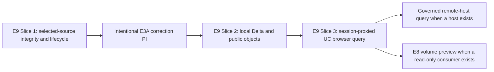

# Rich Lakehouse Workbench — High-Level Strategy

- Status: Revised draft
- Date: 2026-06-20
- Revised: 2026-07-15
- Scope: Define the target architecture and sequence for evolving Axon's editor app into a provider-driven lakehouse workbench while distinguishing landed implementation from proposed work.
- Related:
  - [Rich Lakehouse Workbench Planning Prompts](./rich-lakehouse-workbench-planning-prompts.md)
  - [Browser Lakehouse Engine Strategy](./browser-lakehouse-engine-strategy.md)
  - [Browser Unity Catalog Brokered Runtime Contract](./browser-uc-brokered-runtime-contract.md)
  - [Browser Embedding and Deployment](./browser-embedding-deployment.md)
  - [ADR-0002: Browser Access Uses Signed HTTPS Or A Narrow Proxy, Never Cloud Secrets](../adr/ADR-0002-browser-access-uses-signed-https-or-proxy-never-cloud-secrets.md)

> This document records target architecture. Sections labeled current implementation describe landed behavior; all other effort descriptions are proposed until their plans and code land.

## Vision

Axon is a browser lakehouse query engine with a native correctness oracle. Its north star is a workbench that lets a user discover a resource, obtain one authority-preserving resource binding, run a supported read in the permitted execution location, and receive Arrow data or a deterministic terminal outcome. Local Delta and public object storage remain useful without a host. Authenticated catalogs and remote execution are profiles composed around that core.

The program retains the E0–E9 labels for ownership. Delivery follows the usable
vertical slices in the sequencing section rather than completing horizontal
substrate effort by effort. E3A stabilizes the current contract messages; E3B
migrates only boundaries with active consumers.

## Core reframe: source profiles compose narrow seams

Today the architecture has one concrete governed-product posture: an external host owns catalog authority, policy, access grants, audit, rollout, and server fallback while Axon consumes browser-safe outcomes ([Browser UC Brokered Runtime Contract](./browser-uc-brokered-runtime-contract.md)). That posture is valuable and should be preserved — but it should become **one host integration profile among several** rather than the only shape.

The reframe: Axon becomes an embeddable lakehouse query engine and standalone workbench whose deployment profiles compose narrow seams. A managed analytics platform can consume Axon through governed host contracts. A session-proxied Unity Catalog deployment can combine catalog discovery with browser execution without placing catalog or cloud secrets in browser code.

A `SourceProfile` is the composition root, not another provider interface. It
binds the five narrow seams required for a table workflow and may add a sixth
filesystem seam when the workflow includes file navigation:

- **CatalogProvider** — **discovery only**: where catalog, schema, table, column, and volume metadata comes from. Initial profiles are session-proxied Unity Catalog, `LocalDelta`, and `ObjectStore`. It answers "what exists," not "how do I read it." Anchors E1. Functions, models, and a generic connector SPI are deferred until a consumer proves the need.
- **IdentitySessionProvider** — who the user is and whether the session is valid: an ambient browser session terminated by an Envoy proxy (login/session, no cloud secrets in the browser), vs `LocalDelta` (no auth) vs Tauri/native (OS/native credentials).
- **AuthorizationDecisionProvider** — whether the workbench should proceed. Browser Cedar can enforce access to browser-local resources and make early UX decisions. The service serving protected metadata, bytes, or compute remains the enforcement and audit authority.
- **DataAccessResolver** — _browser read resolution_: "may this client read this specific resource's bytes right now, and from where?" It returns `browser_read` with one memory-only resolved access envelope, `remote_required`, `denied`, or a typed operational error. The envelope carries an openable descriptor, expiry, access class, and correlation/provenance identifiers. A remote executor resolves a logical reference inside its own trust boundary. Anchors E9.
- **ExecutionProvider** — where the query runs and where sample/preview data comes from: `BrowserWasm` (Web Worker, today), then a concrete remote host when one exists. Native remains the correctness oracle. A portable remote service interface is deferred until a real host proves its admission, streaming, cancellation, retry, and audit requirements. Anchors E9.
- **FileSystemProvider (optional)** — paginated listing and stat for file-like
  resources selected from a volume or folder. It returns logical file references;
  access resolution and preview stay in their existing seams. E8 proves the first
  read-only volume implementation. General workspace, document, local-folder,
  editing, and write contracts are deferred.

These seams stay separate because they have different owners, lifetimes, cache rules, and trust boundaries. A host may implement several of them, but each contract remains narrow. Browser execution receives only a resolved browser envelope; remote/native execution receives only a logical reference. An execution request never carries both forms.

All seams use one `CanonicalResourceRef`: connection ID, a versioned provider
namespace, resource kind, and exactly one provider-object-ID or canonical-locator
identity arm. Locator identity is capability-free and produced by the provider's
fixture-tested canonicalizer. Display names, signed URLs, and grants never
participate in equality, cache keys, or audit joins.

Authorization decision and enforcement authority are separate roles. A browser decision can fail early and improve UX, but it cannot authorize a remote service to disclose metadata, bytes, or compute. The remote boundary enforces and owns the authoritative audit record.

### Relationship to existing decisions (extends vs supersedes)

- **Extends** [ADR-0002](../adr/ADR-0002-browser-access-uses-signed-https-or-proxy-never-cloud-secrets.md) (no cloud secrets in the browser). The session-proxied UC profile and governed hosts use browser-safe signed HTTPS or narrow proxy routes. ADR-0002 constrains every effort here.
- **Generalizes** the existing governed-host read-compute contract and the [Browser UC Brokered Runtime Contract](./browser-uc-brokered-runtime-contract.md). Those documents describe one governed profile. The core model also supports browser-local, public-object, and session-proxied catalog profiles without treating any host as the provider taxonomy.
- **Preserves** [ADR-0004](../adr/ADR-0004-native-runtime-is-correctness-oracle-and-mandatory-fallback.md). The native runtime stays the correctness oracle regardless of which ExecutionProvider is active.

## Current state (grounding)

The following statements describe landed implementation, not the target architecture:

- **Local/public vertical slice:** `LocalDelta` and public `ObjectStore` execute through the browser worker. Unity Catalog, governed read resolution, remote execution, and filesystem browsing do not yet work end to end.
- **Source selection is not yet a provider composition:** [query-source.ts](../../apps/axon-web/src/services/query-source.ts) and [query.ts](../../apps/axon-web/src/services/query.ts) still combine source selection, descriptor construction, session management, and execution. Removing wrong-source fallback and giving one selected source explicit authority is E9 Slice 1.
- **Contract substrate has landed:** Buf-managed `axon/common/v1`,
  `axon/catalog/v1`, `axon/dataaccess/v1`, `axon/exec/v1`, and `axon/fs/v1`
  messages have generated TypeScript output. Buffa Rust output exists for
  common, data-access, execution, and filesystem proof, not catalog. The
  filesystem package is messages-only substrate; its E8 provider, adapter, UI,
  and runtime adoption remain proposed, as does app-layer E1/E9 adoption.
- **Execution protobuf is worker-scoped:** the landed `BrowserWorker*` commands, events, and `QueryEngine` service descriptor are compatibility IPC for the browser client/worker boundary. They are not a deployed or portable remote service contract.
- **Arrow IPC already crosses the worker boundary as bytes**, while a bounded JS-cell preview remains for the current UI.
- **State and persistence are in transition:** typed store slices and generated config contracts are landed, while service singletons and persistence across IndexedDB, local storage, OPFS, and File System Access still need consolidation by ownership and access class.

## The ten separable efforts

> E3 is delivered in two phases: **E3A** stabilizes the landed control messages,
> and **E3B** migrates one proven boundary at a time. It does not require a
> protobuf package for every in-process seam.

### E0 — Frontend Foundation: State, Routing, Persistence

Finish the migration by assigning every state item one owner and one persistence class:

- **Discovery state:** remote catalog metadata can use TanStack Query with principal/session-scoped keys, bounded freshness, pagination, and explicit invalidation on connection or session change.
- **Client and runtime state:** editor state, selected source, execution
  lifecycle, and the worker session stay in the client store. The selected
  source identifier is authoritative; query dispatch must not fall back to a
  sample or another connection.
- **Persistence classes:** harmless preferences and public immutable metadata may persist. Local handles persist only with a re-grant lifecycle. Signed URLs, grants, resolved access envelopes, and governed descriptors remain memory-only. Protected object bytes are memory-only until a principal/session namespace, logout invalidation, and enforcement-owner approval exist.
- **Retry boundary:** discovery may use bounded retry for transient failures. Authorization, access resolution, and accepted execution are not generic queries and do not inherit automatic retry behavior.
- **Routing:** deep links identify logical resources, never capabilities or signed URLs.

Dependency: blocks E1, E2, E5, E7. The TanStack Query layer is the seam E1 providers plug into.

### E1 — Pluggable Catalog Providers and Catalog Explorer (discovery)

Adopt the generated discovery messages behind a **discovery-only** `CatalogProvider` and ship one table-first, session-proxied Unity Catalog vertical slice alongside the existing local/object-store paths. The first slice lists catalogs, schemas, tables, columns, and volume references and opens one selected table in the editor. Functions, models, writes, and a generic capabilities framework are deferred. Providers expose plain navigation methods; TanStack Query supplies session-scoped caching and pagination without becoming part of the provider contract.

- **Discovery only.** E1 answers "what catalogs/schemas/tables/volumes exist and what is their metadata." It does **not** resolve bytes or execute. The Explorer hands a logical reference to E9, whose resolver returns `browser_read`, `remote_required`, `denied`, or a typed error before execution acceptance.
- **Explicit connection registry + selectors** in the sidebar and editor, backed by principal/session-scoped query keys. The selected connection and table reference are authoritative query inputs.
- **Lazy catalog tree navigation** (infinite/paginated queries for large catalogs).
- **Volumes as catalog objects (discovery only)** — list volumes and show volume metadata (type, storage location, comment) alongside tables/views in the explorer. Browsing the files _inside_ a volume, previewing, and editing them is **out of scope for E1** and lives in **E8 (Workspace Files & Volumes)**; the catalog only references a volume, it does not open it.
- **A catalog metadata cache** that may feed editor completion later. E1 does not add policy entities solely for a future E4 consumer.
- **Generated contracts are landed.** E1 adopts the `axon/catalog/v1` messages; the UC adapter maps vendored OpenAPI responses at one validated boundary.
- **Session-proxied metadata access.** UC requests use the same-origin session boundary from E6. No catalog token or cloud credential enters browser packages.

> **Update (2026-07-15).** [ADR-0010 "Pluggable Catalog Providers"](../adr/ADR-0010-pluggable-catalog-providers.md) defines the discovery boundary. Generated catalog messages are landed; provider adoption and the Unity Catalog vertical slice are not. E9 owns access resolution and execution. Development can reach a real OSS UC server through a same-origin Vite proxy; production uses a deployment-owned session proxy with the same browser contract.

Dependency: needs E0, E3A (contract messages), and E6 (auth for remote APIs); feeds E2, E4, E7, E8, and E9 (table refs).

### E2 — Editor Modernization: Monaco + Catalog-Aware SQL IntelliSense

Replace the custom textarea editor ([Editor.tsx](../../apps/axon-web/src/editor/components/Editor.tsx)) with Monaco (compare against finishing CodeMirror 6, which is already a dependency). Build a SQL language service that consumes E1 catalog metadata to provide:

- Context-aware completion (databases/schemas/tables/columns ranked by the `FROM` clause).
- Hover cards with table/column type, partitioning, row count, and latest commit.
- Signature help for SQL functions.
- Pre-run diagnostics that surface unsupported-SQL / fallback reasons as squiggles before execution.
- Multi-tab editing with per-tab catalog/connection context.

Dependency: needs E0 and E1 metadata.

### E3 — Contract IDL And Boundary Adoption

E3A has landed generated `axon/common/v1`, `axon/catalog/v1`,
`axon/dataaccess/v1`, `axon/exec/v1`, and `axon/fs/v1` control messages. Arrow
IPC remains the result data plane. The next work is adoption and one intentional
pre-adoption correction, not another broad inventory of future contracts.

#### E3A — Stabilize The Landed Contract Surfaces

- Treat `CatalogProvider`, `DataAccessResolver`, and `ExecutionProvider` as in-process TypeScript seams that consume generated domain messages; do not encode TanStack Query or HTTP mechanics in protobuf.
- Reclassify `BrowserWorker*` commands/events and the current `QueryEngine` service descriptor as browser worker compatibility IPC. Do not claim remote portability from matching message shapes.
- Correct resource binding before adoption: browser execution accepts one openable resolved envelope; remote/native execution accepts one logical reference. Carry expiry and correlation/provenance through the browser envelope.
- Collapse duplicated resolution variants into one canonical pre-acceptance union:
  `browser_read`, `remote_required`, `denied`, or a typed operational error.
- Run the Buf `FILE` breaking check during the one intentional correction,
  record the accepted breaks, and establish the result as the new baseline.
  Further changes require an explicit migration.
- Keep Rust generation reproducible and add new Rust packages only where a Rust
  consumer exists. The filesystem messages are already generated; do not claim
  an E8 provider, adapter, UI, or runtime until its read-only consumer lands.
  Do not add decision packages before a vertical slice consumes them.

#### E3B — Migrate Proven Boundaries Only

- Migrate the browser client/worker control boundary with parity tests, then retire the corresponding hand-maintained TypeScript mirror.
- Preserve Arrow IPC for streamed result bytes and bounded previews.
- Defer a portable remote `QueryEngine` service, Connect transport, Tauri provider, and generic auth metadata until one remote host supplies concrete requirements and an executable conformance test.
- When that consumer exists, design its remote service separately around identity, admission, deadlines, backpressure, idempotent cancellation, terminal outcomes, and audit. Reuse stable domain messages where they fit; do not expose browser worker lifecycle commands as the service API.

Dependency: E9 Slice 1 establishes selected-source integrity and lifecycle
without protobuf changes. The intentional E3A correction follows and is a
mandatory gate before E9 Slice 2 or other app-layer contract adoption. E3B
proceeds boundary by boundary after a consumer exists.

### E4 — Optional Local Authorization Decisions

Defer Cedar until a standalone policy consumer exists. The first E1/E9 slices need an authorization-decision interface and explicit enforcement ownership, not a bundled policy engine.

- A browser decision may permit or deny workbench actions and can enforce access to browser-local resources.
- A protected catalog, object gateway, or remote executor repeats authorization at its own boundary and owns audit. Browser policy is early UX, never a bearer capability.
- `unknown` fails closed. `denied` and `remote_required` are distinct pre-acceptance outcomes.
- If Cedar is later selected, its schema, policy source, version, bundle cost, and conformance suite must be justified by that consumer.

Dependency: no current vertical slice depends on a Cedar implementation. E1/E9 depend only on the narrow decision contract.

### E5 — Arrow-Native Visualization Layer

Adopt Apache Arrow JS to consume the existing Arrow IPC result bytes directly (they already cross the worker boundary per [Browser Embedding and Deployment](./browser-embedding-deployment.md)), eliminating the row-JSON materialization currently done for preview.

- A virtualized table grid that reads Arrow vectors directly.
- A charting layer over Arrow columns; auto-suggest encodings from schema; "chart from result."
- Evaluate canvas/WebGL for large results.

Dependency: needs E0; uses the Arrow transport already present. Foundation for E7.

### E6 — Authentication And Session

The deployment proxy serves the app and terminates login, maintaining an ambient browser session. The browser never receives cloud, UC, or general-purpose bearer credentials, aligning with [ADR-0002](../adr/ADR-0002-browser-access-uses-signed-https-or-proxy-never-cloud-secrets.md).

- **App-shell session model:** UC and governed-host metadata calls use same-origin requests with `credentials: 'include'`; expiry clears session-scoped discovery state and all memory-only access envelopes.
- **Worker access model:** browser reads use either public HTTPS, object-scoped signed URLs, or same-origin narrow proxy routes. Do not inject catalog or cloud bearer tokens into worker descriptors. The resolved envelope expires no later than its shortest capability and is refreshed only before accepting new execution.
- **Cross-origin isolation tension:** threaded/SIMD WASM bundles need COOP/COEP cross-origin isolation (per the bundle manifest in [axon-browser-sdk.ts](../../apps/axon-web/src/axon-browser-sdk.ts)); `COEP: require-corp` interacts with credentialed cross-origin fetches and bundle/asset loading. The Envoy + CORS/COOP/COEP header story must be designed together (a single-origin Envoy is the simplest reconciliation).
- **Profile seam:** native and local profiles do not assume a browser session. Their credentials remain inside their own trust boundary.

Dependency: cross-cutting — pairs with E1 metadata access, E9 capability lifetime, and the WASM HTTP layer. A later remote host defines its own RPC authentication at that service boundary.

### E7 — Delta Table Insight and Health Surface

A dedicated UI surface for understanding a Delta table from its Delta log — not query results, but the table's own structure and health.

- **Metadata and enabled features:** schema, partitioning, table properties, and the enabled Delta protocol / reader-writer features rendered as a capability/feature view, sourced from [delta_protocol_features.rs](../../crates/query-contract/src/delta_protocol_features.rs) (`DeltaProtocolFeature`, `KNOWN_DELTA_PROTOCOL_FEATURES`) and the `CapabilityReport` in [query-contract](../../crates/query-contract/src/lib.rs) — showing supported vs native-only vs unsupported per feature (deletion vectors, column mapping, CDF, timestamp-ntz, etc.).
- **Stats-boundary plots:** visualize per-column min/max boundaries across add-file stats from the reconstructed log ([wasm-delta-snapshot](../../crates/wasm-delta-snapshot/src/lib.rs)) and Parquet footer stats (`ParquetInspectionSummary` via `inspect_parquet` / `preflight_parquet_metadata_for_targets` in [apps/axon-web/src/lib.rs](../../apps/axon-web/src/lib.rs)): per-file value ranges, range overlap (a proxy for data-skipping/pruning effectiveness), null-count and row-count distributions, and stats-coverage gaps.
- **Health signals:** file-size histogram (small-file problem), file count, partition cardinality/skew, commit/log growth over the snapshot-version timeline ([snapshot.ts](../../apps/axon-web/src/services/snapshot.ts) commits feed), checkpoint cadence, and tombstone/removed-file counts.

Mostly read-only over data Axon already reconstructs — high insight value for relatively contained new work.

Dependency: needs E5 (plots) and E1 (table selection/metadata); reuses the existing snapshot/log reconstruction.

### E8 — Workspace Files and Volumes

E8 begins with one read-only volume slice, not a general workspace abstraction:

- `axon/fs/v1` messages are landed contract substrate; this slice supplies the
  first provider, adapter, UI, and runtime consumer rather than redesigning the
  package in advance.
- E1 returns a logical volume reference.
- A volume filesystem adapter lists one directory level with pagination and returns logical file references.
- Selecting one file resolves a short-lived browser-safe read through the same authority rules as E9 and opens a bounded preview.
- Parquet preview reuses the existing inspection/query path. Add one further format only after limits and truncation behavior are tested.
- The catalog, filesystem, resolver, and executor remain separate owners. Volume discovery never returns signed URLs.

Writes, upload, `Document` as a backend, a universal file tab model, and a cross-provider filesystem capabilities framework are deferred until the read-only slice is usable.

Dependency: needs the E1 volume reference, E6 session boundary, and E9 access/execution lifecycle.

### E9 — Execution Provider and Data Access Resolution

E9 is the next vertical integration effort. Its [execution plan](../plans/2026-07-15-e9-execution-provider-vertical-slice-plan.md) orders the work around usable slices.

- **Slice 1 fixes source authority and lifecycle without protobuf changes:** a
  run names one selected connection and resource. Missing or invalid selection
  fails; it never falls back to sample data or another source. The domain
  `execution_id` maps to existing worker correlation fields until the correction
  PI.
- **Then correct the unadopted contracts:** one intentional E3A PI aligns
  canonical identity, binding, resolution, admission, and terminal-state wire
  shapes before provider adoption.
- **Adopt one browser path:** `DataAccessResolver` returns `browser_read` with one resolved envelope, `remote_required`, `denied`, or a typed error. The envelope is memory-only and includes the directly openable descriptor, expiry, access class, and correlation/provenance identifiers.
- **Adopt one execution lifecycle:** the run controller creates `execution_id`
  before admission. The provider admits identical retries idempotently, rejects
  mismatched ID reuse, and atomically records one completed, failed, or cancelled
  terminal state. The initial browser path returns one byte-budgeted Arrow IPC
  buffer; chunked delivery waits for an explicit credit protocol.
- **Preserve authority:** browser/local execution accepts a resolved envelope. Remote/native execution accepts a logical reference and resolves server-side. Neither accepts both.
- **Retry deliberately:** discovery and pre-acceptance resolution may retry within expiry. Accepted execution is not automatically retried.
- **Fail closed:** policy refusal becomes `denied`; unsupported browser work
  becomes `remote_required` only when a known enforcement owner can run it.
  Unknown authority, expired capability, invalid adapter data, and unsafe URLs
  become typed resolution errors before the worker opens a table.

After Slice 1 and the mandatory E3A correction, E9 Slice 2 preserves local/public
behavior behind the resolver and executor seams. Slice 3 then proves one
session-proxied Unity Catalog browser query by composing E1 and E6. A remote host
contract follows only when a host implementation exists, and E8 runtime adoption
waits for a read-only volume consumer.

## Dependency and sequencing view

The first four nodes are the mandatory sequence, not a requirement to finish
every horizontal effort first. E9 Slice 1 fixes source authority and lifecycle
without protobuf changes. The intentional E3A correction follows before E9
Slice 2 adopts the local/public seams. E1 discovery and the E6 session boundary
then compose with E9 Slice 3 for the protected UC browser query. Governed remote
execution and volume preview are independently gated extensions after that
browser-read path: the remote contract waits for its host, while E8 runtime
adoption waits for a read-only file-navigation consumer. Neither extension
blocks the other. E2, E5, and E7 can proceed when they have direct product
demand; E4 and broad E3B work are deferred until a consumer proves the need.

## Product interaction invariants

- The selected connection and resource stay visible and authoritative through a
  run. Sample data requires an explicit sample selection.
- The workbench surfaces `remote_required`, `denied`, session expiry, and
  unsupported execution before presenting an accepted browser run.
- Routes and saved state contain logical references only. They never contain
  grants, signed URLs, or resolved browser bindings.
- Admission, run progress, cancel, and the terminal result use one caller-created
  `execution_id`.
- File preview starts read-only and bounded. It adds formats or editing only
  after the first Parquet preview slice proves the filesystem and access seams.

## Risks and cross-cutting constraints

- **Secret boundary (ADR-0002).** Every remote profile must keep cloud/catalog secrets out of the browser. The session-proxied UC profile depends on this holding.
- **Cross-origin isolation vs credentials.** Threaded WASM requires COOP/COEP; credentialed fetch interacts with `COEP: require-corp`. E6 must design headers and origin layout up front.
- **Capability lifetime.** A valid descriptor can outlive the grant that produced it unless expiry travels with the execution binding. Capability-bearing envelopes require the shortest underlying expiry, are scoped to one admission/execution, and never persist or carry into a new execution.
- **Contract migration risk.** The landed protobuf substrate still overlaps older JSON and TypeScript shapes. Migrate one authority-crossing boundary at a time with validation and parity tests.
- **Execution identity ambiguity.** Request IDs, query IDs, and cancel IDs can
  drift. E9 establishes one caller-created `execution_id`, idempotent admission,
  one authoritative terminal state, and at-most-one terminal stream frame before
  adding remote execution.
- **Cache authority.** Discovery metadata, protected bytes, and capabilities require different namespaces and invalidation. A generic persisted query or byte cache must not blur them.
- **WASM bundle size.** Arrow JS, editor changes, or a future local PDP must justify their cost against existing size gates.

## Out of scope for this strategy document

- Detailed per-effort designs (deferred to the dedicated planning sessions seeded by the [planning prompts](./rich-lakehouse-workbench-planning-prompts.md)).
- Designing a generic remote service without a concrete host consumer.
- Committing the project to specific library choices where the efforts explicitly list them as decisions (state library, Monaco vs CodeMirror, Rust codegen backend, charting library).
