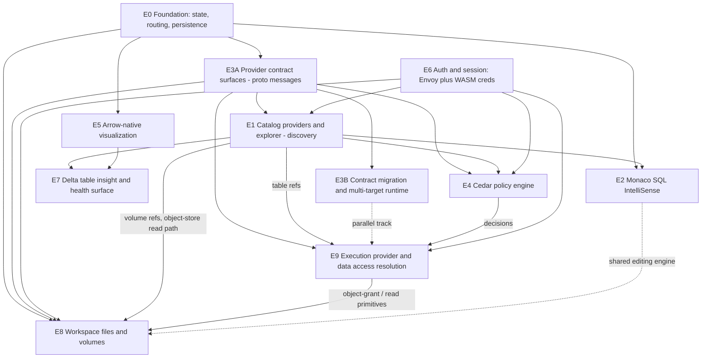

# Rich Lakehouse Workbench — High-Level Strategy

- Status: Draft
- Date: 2026-06-20
- Scope: Propose the high-level direction for evolving Axon's editor app into a pluggable, provider-driven rich lakehouse workbench, broken into separable efforts for team discussion and dedicated planning sessions.
- Related:
  - [Rich Lakehouse Workbench Planning Prompts](./rich-lakehouse-workbench-planning-prompts.md)
  - [Browser Lakehouse Engine Strategy](./browser-lakehouse-engine-strategy.md)
  - [Browser Unity Catalog Brokered Runtime Contract](./browser-uc-brokered-runtime-contract.md)
  - [Browser Embedding and Deployment](./browser-embedding-deployment.md)
  - [ADR-0002: Browser Access Uses Signed HTTPS Or A Narrow Proxy, Never Cloud Secrets](../adr/ADR-0002-browser-access-uses-signed-https-or-proxy-never-cloud-secrets.md)

> This is a strategy and discussion document. It does not change code or commit the project to any specific implementation. Each effort below seeds a dedicated planning session (see the companion [planning prompts](./rich-lakehouse-workbench-planning-prompts.md)) that will validate feasibility and produce a detailed execution plan.

## Vision

Axon today is a narrow but real browser query engine for Delta Lake, with a native correctness oracle and a contract-first integration posture toward external host products and control planes. The goal of this strategy is to grow that foundation into a **rich environment for working with and exploring lakehouses**: connect to remote catalogs, browse them efficiently, write SQL with first-class editor support, visualize results and table health directly from Arrow, and make policy decisions in-app — across multiple deployment targets (browser, desktop, and a future service).

This document frames that ambition as a **core architectural reframe** plus **ten separable efforts** (E0–E9). The efforts are intentionally decoupled so they can be planned, staffed, and shipped independently, with explicit dependencies called out. (E3 is delivered in two phases — **E3A** provider contract surfaces, then **E3B** contract migration + multi-target runtime — see below.)

## Core reframe: a pluggable provider model

Today the architecture has one concrete governed-product posture: an external host owns catalog authority, policy, access grants, audit, rollout, and server fallback while Axon consumes browser-safe outcomes ([Browser UC Brokered Runtime Contract](./browser-uc-brokered-runtime-contract.md)). That posture is valuable and should be preserved — but it should become **one host integration profile among several** rather than the only shape.

The reframe: Axon becomes an embeddable lakehouse query engine and standalone rich lakehouse client where the catalog source, the authentication/session authority, the authorization authority, and the execution backend are all **pluggable seams**. A managed analytics platform can consume Axon through governed host contracts. A standalone/direct profile — "direct Unity Catalog REST + in-app Cedar authorization + local or remote execution" — becomes a first-class peer.

Six provider seams anchor every effort:

- **CatalogProvider** — **discovery only**: where table/metadata _structure_ comes from (list catalogs/schemas/tables/views/volumes/functions/models + metadata): `DirectUnityCatalog` (UC REST), governed-host catalog listing, `LocalDelta`, `ObjectStore`. It answers "what exists," not "how do I read it." Anchors E1.
- **Identity/SessionProvider** — who the user is and whether the session is valid: an ambient browser session terminated by an Envoy proxy (login/session, no cloud secrets in the browser), vs `LocalDelta` (no auth) vs Tauri/native (OS/native credentials).
- **AuthorizationProvider (PDP)** — whether an action is allowed: `Cedar` (in-app, authoritative in standalone mode; advisory when a governed host is authoritative) or a host-owned policy service.
- **DataAccessResolver** — _read resolution_: "may this client read this specific table's bytes right now, and from where?" Returns the `ReadAccessPlan` / `BrowserHttpSnapshotDescriptor` / `fallback` / `blocked` family. Profiles: brokered UC (object-grant / credential-vending), governed host `ReadAccessPlan`, `LocalDelta`, `ObjectStore`. Policy-gated, short-lived, fail-closed — never cached like discovery. Consumed by the `BrowserWasm` execution backend; a `RemoteService` backend resolves reads server-side and bypasses it. Anchors E9.
- **ExecutionProvider** — where the query runs and where sample/preview data comes from: `BrowserWasm` (Web Worker, today), `Tauri` (native runtime via IPC), `RemoteService` (Connect/gRPC). Anchors E9.
- **FileSystemProvider / Workspace** — where file-like bytes and directory listings come from: `UnityCatalogVolume` (UC Volumes Files API), `ObjectStorePrefix` (bucket prefixes), `LocalFolder` (OPFS / File System Access), and `Document` (saved queries/files). Distinct from CatalogProvider: the catalog answers "what tables/volumes/metadata exist," the FileSystemProvider answers "what files are inside a volume/folder and how do I read or write their bytes." Anchors E8.

These seams are deliberately separate because they answer different questions with different lifecycles and trust properties: Identity/Session answers "who is this and is the session valid," Authorization answers "may they do this," CatalogProvider answers "what exists" (cacheable for minutes), DataAccessResolver answers "how, if at all, may I read these bytes right now" (short-lived, fail-closed), ExecutionProvider answers "run it / sample it" (backend-pluggable), and FileSystemProvider answers "what files are inside, and read/write their bytes." A single host may implement several seams (catalog listing, read-plan issuance, session access, and policy authority), but the consumer-facing contracts stay distinct — so the Catalog Explorer never reaches into execution, and a future `RemoteService` executor needs no browser-side read resolution.

### Relationship to existing decisions (extends vs supersedes)

- **Extends** [ADR-0002](../adr/ADR-0002-browser-access-uses-signed-https-or-proxy-never-cloud-secrets.md) (no cloud secrets in the browser). The Envoy session model and the "direct UC" profile must still never place cloud or catalog secrets in browser code; the proxy and signed-URL/narrow-proxy patterns remain the rule. ADR-0002 is a hard constraint on every effort here.
- **Generalizes** the existing governed-host read-compute contract and the [Browser UC Brokered Runtime Contract](./browser-uc-brokered-runtime-contract.md). Those documents describe one close governed-host consumer profile where the host owns product authority and Axon consumes safe outcomes. The reframe keeps that profile while making the core Axon model host-agnostic: a managed analytics platform, a direct UC deployment, a desktop shell, or a local-only workflow can all consume the same engine seams. Whether the existing consumer contract should be amended or a new ADR added is a decision for the E1/E9/E4 planning sessions.
- **Preserves** [ADR-0004](../adr/ADR-0004-native-runtime-is-correctness-oracle-and-mandatory-fallback.md). The native runtime stays the correctness oracle regardless of which ExecutionProvider is active.

## Current state (grounding)

Brief, so the efforts below are concrete rather than abstract:

- **State management** is hand-rolled: module-singleton `subscribe`/`snapshot` stores in [apps/axon-web/src/services/](../../apps/axon-web/src/services) plus ~25 `useState` hooks in [App.tsx](../../apps/axon-web/src/editor/App.tsx). No state library. Persistence is split across IndexedDB ([metadata.ts](../../apps/axon-web/src/services/metadata.ts)), localStorage ([connect/store.ts](../../apps/axon-web/src/editor/connect/store.ts)), and OPFS / File System Access ([local-delta.ts](../../apps/axon-web/src/services/local-delta.ts)).
- **Routing** is a minimal History-API helper ([router.ts](../../apps/axon-web/src/editor/router.ts)); the `/catalogs` route is declared but never rendered.
- **Editor** is a custom `<textarea>` + tokenizer ([Editor.tsx](../../apps/axon-web/src/editor/components/Editor.tsx), [highlight.ts](../../apps/axon-web/src/editor/lib/highlight.ts)). CodeMirror is a dependency but unused; there is no IntelliSense/hover/completion service.
- **Catalog/connect** models four source types but only `LocalDelta` and public `ObjectStore` (GCS) execute end-to-end; Unity Catalog and Delta Sharing are stubbed behind a feature flag ([ConnectModal.tsx](../../apps/axon-web/src/editor/connect/ConnectModal.tsx), [query-source.ts](../../apps/axon-web/src/services/query-source.ts)).
- **Contracts** are serde JSON in [query-contract](../../crates/query-contract/src/lib.rs) with a large hand-maintained TypeScript mirror in [axon-browser-sdk.ts](../../apps/axon-web/src/axon-browser-sdk.ts). No protobuf anywhere.
- **Frontend↔WASM boundary** is `BrowserWorkerCommand`/response envelopes over `postMessage` plus an Arrow IPC byte side-channel ([browser-sdk](../../crates/browser-sdk/src/lib.rs), [sandbox-query-worker.ts](../../apps/axon-web/src/sandbox-query-worker.ts)).
- **Arrow IPC already crosses the worker boundary as bytes**, but the UI converts to JS cells for preview — the opposite of native Arrow visualization.

## The ten separable efforts

> E3 is delivered in two phases: **E3A** (provider contract surfaces — proto messages for every seam, pulled forward right after E0) and **E3B** (contract migration + multi-target runtime). They are listed together under E3 below.

### E0 — Frontend Foundation: State, Routing, Persistence

The substrate for everything else. Replace the hand-rolled singletons and `useState` sprawl with a scalable, typed state architecture. The key design decision is to **split state by ownership**:

- **Server/remote state → TanStack Query.** All data fetched from remote APIs (Unity Catalog REST, governed-host `ReadAccessPlan` endpoints, object-store/GCS listings, volume file metadata) is modeled as queries/mutations with a `queryKey` hierarchy (e.g. `[provider, catalogId, 'schemas', schemaId, 'tables']`). This gives caching, background refetch, `staleTime`/freshness control, request dedup, retry/backoff, pagination/infinite queries for large catalog trees, optimistic mutations, and per-query loading/error states. This is exactly the caching/activeness behavior we want for remote catalogs, and it doubles as the catalog metadata cache that E2 IntelliSense and E4 policy entities read from.
- **Client/UI + session state → a lightweight store** (evaluate Zustand vs Redux Toolkit vs XState; recommend Zustand + slices for low ceremony). Owns non-server state: editor tabs/buffers, active connection + catalog/schema/table selectors, layout/tweaks, in-flight query-run lifecycle, and the long-lived WASM session handle in [query.ts](../../apps/axon-web/src/services/query.ts) (the worker is a client resource, not a TanStack query). Document the boundary so server state is never duplicated into the client store.
- **Unified persistence abstraction** over IndexedDB ([metadata.ts](../../apps/axon-web/src/services/metadata.ts)), localStorage ([connect/store.ts](../../apps/axon-web/src/editor/connect/store.ts)), File System Access handles, and OPFS ([local-delta.ts](../../apps/axon-web/src/services/local-delta.ts)) — with explicit support for the "read files from disk" lifecycle and re-grant flows. Decide which TanStack caches are persisted (`persistQueryClient`) vs memory-only.
- **A real router.** Wire the dead `/catalogs` route in [router.ts](../../apps/axon-web/src/editor/router.ts); support deep links to catalog/schema/table, saved queries, and the E7 table-insight surface. Consider TanStack Router (pairs naturally with TanStack Query for route-driven prefetch/loaders) as one option.

Dependency: blocks E1, E2, E5, E7. The TanStack Query layer is the seam E1 providers plug into.

### E1 — Pluggable Catalog Providers and Catalog Explorer (discovery)

Define the **discovery-only** `CatalogProvider` interface and ship the `DirectUnityCatalog` provider (UC REST: list catalogs/schemas/tables/views/volumes/functions/models + table metadata) alongside the existing local/object-store paths in [query-source.ts](../../apps/axon-web/src/services/query-source.ts) and [ConnectModal.tsx](../../apps/axon-web/src/editor/connect/ConnectModal.tsx). Governed host catalog-listing profiles stay compatible but deferred. Providers expose plain navigation methods that a TanStack Query layer wraps with query keys, caching, background refresh, dedup, and pagination from E0. E1 is the Catalog Explorer surface: browse, search, drill into metadata.

- **Discovery only.** E1 answers "what catalogs/schemas/tables/volumes exist and what is their metadata." It does **not** resolve how to read a table's bytes or run a query — _read resolution_ (the `ReadAccessPlan`/descriptor/`fallback`/`blocked` family) is the **DataAccessResolver** seam and _execution_ (run/sample) is the **ExecutionProvider** seam, both owned by **E9**. The Explorer's "Sample data" and "Open in SQL editor" actions hand a table _ref_ to E9; they do not live in the catalog provider.
- **Multi-catalog connection registry + selectors** in both the sidebar and the editor, each backed by provider-scoped query keys so switching catalogs reuses cached metadata and refreshes stale entries in the background.
- **Lazy catalog tree navigation** (infinite/paginated queries for large catalogs).
- **Volumes as catalog objects (discovery only)** — list volumes and show volume metadata (type, storage location, comment) alongside tables/views in the explorer. Browsing the files _inside_ a volume, previewing, and editing them is **out of scope for E1** and lives in **E8 (Workspace Files & Volumes)**; the catalog only references a volume, it does not open it.
- **A catalog metadata cache** that feeds editor IntelliSense (E2) and policy entities (E4).
- **Typed contracts come from E3A.** E1's node/metadata shapes are the E3A-generated proto messages (DirectUC maps UC's OpenAPI types into the normalized messages), not hand-written TS sketches.
- **Open question:** where UC credential exchange / CORS lives given [ADR-0002](../adr/ADR-0002-browser-access-uses-signed-https-or-proxy-never-cloud-secrets.md) — likely the Envoy session seam from E6 (a thin token/proxy boundary), reconciled with the pluggable model.

> **Update (2026-06-21).** [ADR-0010 "Pluggable Catalog
> Providers"](../adr/ADR-0010-pluggable-catalog-providers.md) now defines the
> provider boundary. ADR-0010
> makes the boundary explicit: **CatalogProvider discovers**, **DataAccessResolver
> resolves**, and **ExecutionProvider runs/previews**. E1 owns generated
> `axon/catalog/v1` navigation nodes when E3A lands, plus provider paginators
> (`Page<T>`) with TanStack Query options layered on top. E9 owns
> `axon/dataaccess/v1` resolution outcomes, including `descriptor`,
> `read_access_plan`, `fallback`, and `blocked`. **Envoy is deployment-only**:
> dev and integration tests should run a real OSS UC server reached same-origin
> through the Vite proxy (`/api/uc`), keeping `SessionHttp`'s contract unchanged.

Dependency: needs E0, E3A (contract messages), and E6 (auth for remote APIs); feeds E2, E4, E7, E8, and E9 (table refs).

### E2 — Editor Modernization: Monaco + Catalog-Aware SQL IntelliSense

Replace the custom textarea editor ([Editor.tsx](../../apps/axon-web/src/editor/components/Editor.tsx)) with Monaco (compare against finishing CodeMirror 6, which is already a dependency). Build a SQL language service that consumes E1 catalog metadata to provide:

- Context-aware completion (databases/schemas/tables/columns ranked by the `FROM` clause).
- Hover cards with table/column type, partitioning, row count, and latest commit.
- Signature help for SQL functions.
- Pre-run diagnostics that surface unsupported-SQL / fallback reasons as squiggles before execution.
- Multi-tab editing with per-tab catalog/connection context.

Dependency: needs E0 and E1 metadata.

### E3 — Contract IDL and Multi-Target Runtime (Buf-managed protobuf), in two phases

So much of E1/E9/E8/E4 hinges on getting the seam contracts right that the **message layer is pulled forward** and defined once, in proto, before the seam efforts hand-write TypeScript interfaces. E3 therefore splits into an early **E3A** (the contract surfaces) and a later **E3B** (the rest of the migration + runtime).

#### E3A — Provider contract surfaces (early, right after E0)

One reviewable proto tree that is the canonical picture of every pluggable surface. It **extends the `axon/config/v1` Buf module planned in E0** (`buf.yaml`, `buf.gen.yaml`, and `proto/axon/config/v1/settings.proto`) once that milestone lands, and adds a Rust backend — **preferring [buffa](https://github.com/anthropics/buffa)** (pure-Rust, `no_std`, buf remote plugin) over prost, contingent on verifying `wasm32-unknown-unknown`.

- **Messages-first.** Define the message contracts for all seams: catalog **discovery** nodes/metadata (`CatalogNode`/`SchemaNode`/`TableNode`/`TableMetadata`/`VolumeNode`/`FunctionNode`/`ModelNode`), **data-access resolution** + descriptors (port the existing serde/JSON-schema [read-access-plan.schema.json](../../crates/query-contract/schemas/read-access-plan.schema.json) + [object-grants.openapi.json](../../crates/query-contract/schemas/object-grants.openapi.json)), **execution** request/response + worker IPC envelopes (from [browser-sdk](../../crates/browser-sdk/src/lib.rs)), and **filesystem** entries (E8).
- **Services only at transport boundaries.** The execution surface (worker IPC + future `RemoteService`) gets proto _services_; the local provider seams (discovery via TanStack `queryOptions`) stay TS interfaces that _consume_ generated messages.
- **UC REST stays OpenAPI-vendored** (per E1): proto defines the _normalized_ nodes; the DirectUC provider maps UC's OpenAPI types into them. We do not re-proto the UC wire format.
- **Living draft.** `breaking: FILE` stays relaxed during E3A (the contract is expected to churn) until E1/E9/E8 clients adopt the generated types; the gate tightens at adoption.

Dependency: needs E0 (the Buf seam); feeds E1, E9, E8, E4 (and E3B builds on it). This is the contract substrate the seam efforts build on.

#### E3B — Contract migration and multi-target runtime (later, parallel track)

The remainder of the original E3: complete the migration of the control/contract plane in [query-contract](../../crates/query-contract/src/lib.rs) to protobuf, retire the hand-maintained TS mirror in [axon-browser-sdk.ts](../../apps/axon-web/src/axon-browser-sdk.ts), and stand up the transport-agnostic runtime.

- **Buf toolchain hardening:** `buf lint` + breaking-change detection wired into CI as a contract gate; BSR for module/dependency management; confirm the Rust runtime backend chosen in E3A (**buffa** preferred, prost fallback) builds for `wasm32-unknown-unknown` at acceptable size.
- **Transport-agnostic QueryEngine RPC surface** (Connect) implemented by the E9 ExecutionProviders: `BrowserWasm` (today), `Tauri` (native via IPC, reusing [native-query-runtime](../../crates/native-query-runtime/src/lib.rs)), `RemoteService`. No servers are implemented here — contracts plus client/runtime bindings only.
- **Migration safety:** round-trip parity tests against the current JSON contracts before the hand-written TS mirror is retired.
- **Hard constraint:** Arrow IPC stays the data plane; protobuf is the control plane only. Honor the documented no-go on DataFusion/Substrait proto as the hot-path IR ([Browser DataFusion Size Audit](./browser-datafusion-size-audit.md)).

Dependency: needs E3A; largely parallelizable thereafter; coordinates with E9 (runtime surface), E4 (decision types), and E6 (auth metadata on RPCs).

### E4 — In-App Authorization: Cedar Policy Engine

Integrate Cedar (the `cedar-policy` Rust crate, compiled to WASM) as a pluggable PDP for client-side authorization in standalone mode (advisory when a governed host remains authoritative).

- **Model entities/schema:** principal, catalog, schema, table, volume; actions such as `browse`, `query`, `export`.
- **Decision point** wired into the request path, with allow/deny mapped onto the existing structured taxonomy (`FallbackReason`, `BlockedReadPlan` in [query-contract](../../crates/query-contract/src/lib.rs)).
- **Reconcile** with existing governed-host contracts: in a governed-host consumer profile, policy remains host-owned and Cedar is advisory; in the standalone profile, Cedar is authoritative for client-side gating but must never be presented as a substitute for server-side enforcement of governed shapes.

Dependency: needs the E1 entity model, the E3 decision contract types, and the authenticated principal from E6.

### E5 — Arrow-Native Visualization Layer

Adopt Apache Arrow JS to consume the existing Arrow IPC result bytes directly (they already cross the worker boundary per [Browser Embedding and Deployment](./browser-embedding-deployment.md)), eliminating the row-JSON materialization currently done for preview.

- A virtualized table grid that reads Arrow vectors directly.
- A charting layer over Arrow columns; auto-suggest encodings from schema; "chart from result."
- Evaluate canvas/WebGL for large results.

Dependency: needs E0; uses the Arrow transport already present. Foundation for E7.

### E6 — Authentication and Session (Envoy proxy + WASM credential propagation)

Assume an **Envoy proxy** fronts the deployment: it serves the static bundle and terminates login, maintaining a browser session (e.g. OIDC via Envoy's oauth2 filter / ext_authz, with a session cookie). The browser therefore never holds cloud or UC secrets, aligning with [ADR-0002](../adr/ADR-0002-browser-access-uses-signed-https-or-proxy-never-cloud-secrets.md).

- **App-shell session model:** how UC and governed-host API calls (E1 TanStack Query fetchers) carry the session — same-origin requests through Envoy with `credentials: 'include'`, 401/redirect-to-login handling, session expiry/refresh surfaced to the UI.
- **The WASM integration is the hard part.** The query runtime makes its own HTTP range reads from inside the Web Worker via [wasm-http-object-store](../../crates/wasm-http-object-store/src/lib.rs). For authenticated/proxied reads, those `fetch` calls must carry the session. Resolve in the planning session: (a) ambient cookie/session on same-origin proxied reads (worker `fetch` with credentials) vs (b) explicit bearer-token injection threaded into the object-store/descriptor layer; how this maps onto the existing `signed_url` vs `proxy` access modes in [query-contract](../../crates/query-contract/src/lib.rs); and the worker-vs-main-thread credential boundary.
- **Cross-origin isolation tension:** threaded/SIMD WASM bundles need COOP/COEP cross-origin isolation (per the bundle manifest in [axon-browser-sdk.ts](../../apps/axon-web/src/axon-browser-sdk.ts)); `COEP: require-corp` interacts with credentialed cross-origin fetches and bundle/asset loading. The Envoy + CORS/COOP/COEP header story must be designed together (a single-origin Envoy is the simplest reconciliation).
- **Pluggable seam:** Tauri/native and LocalDelta profiles bypass Envoy (native credentials or no auth); the SessionProvider seam must not assume a browser session.

Dependency: cross-cutting — pairs with E1 (API auth) and E3 (auth metadata/credentials on RPCs and the RemoteService transport); informs E4 (authenticated principal feeds Cedar entities); touches the WASM HTTP layer.

### E7 — Delta Table Insight and Health Surface

A dedicated UI surface for understanding a Delta table from its Delta log — not query results, but the table's own structure and health.

- **Metadata and enabled features:** schema, partitioning, table properties, and the enabled Delta protocol / reader-writer features rendered as a capability/feature view, sourced from [delta_protocol_features.rs](../../crates/query-contract/src/delta_protocol_features.rs) (`DeltaProtocolFeature`, `KNOWN_DELTA_PROTOCOL_FEATURES`) and the `CapabilityReport` in [query-contract](../../crates/query-contract/src/lib.rs) — showing supported vs native-only vs unsupported per feature (deletion vectors, column mapping, CDF, timestamp-ntz, etc.).
- **Stats-boundary plots:** visualize per-column min/max boundaries across add-file stats from the reconstructed log ([wasm-delta-snapshot](../../crates/wasm-delta-snapshot/src/lib.rs)) and Parquet footer stats (`ParquetInspectionSummary` via `inspect_parquet` / `preflight_parquet_metadata_for_targets` in [apps/axon-web/src/lib.rs](../../apps/axon-web/src/lib.rs)): per-file value ranges, range overlap (a proxy for data-skipping/pruning effectiveness), null-count and row-count distributions, and stats-coverage gaps.
- **Health signals:** file-size histogram (small-file problem), file count, partition cardinality/skew, commit/log growth over the snapshot-version timeline ([snapshot.ts](../../apps/axon-web/src/services/snapshot.ts) commits feed), checkpoint cadence, and tombstone/removed-file counts.

Mostly read-only over data Axon already reconstructs — high insight value for relatively contained new work.

Dependency: needs E5 (plots) and E1 (table selection/metadata); reuses the existing snapshot/log reconstruction.

### E8 — Workspace Files and Volumes

A dedicated **file-handling experience** and the **FileSystemProvider / Workspace** seam behind it. E1 makes the catalog _reference_ a volume as an object; E8 is where users actually **browse the files inside** a volume (or a bucket prefix, or a local folder), **preview** them, and — later — **edit/write** them. This is intentionally separate from the SQL editor: it is a different surface with different (non-SQL) tab kinds.

- **FileSystemProvider seam** — a uniform `list / stat / read / (later) write` contract over file-like backends: `UnityCatalogVolume` (UC Volumes Files API), `ObjectStorePrefix` (bucket prefixes, extending [object-storage.ts](../../apps/axon-web/src/services/object-storage.ts)), `LocalFolder` (OPFS / File System Access, extending [local-delta.ts](../../apps/axon-web/src/services/local-delta.ts)), and `Document` (saved queries/files as a backend). Reads reuse the existing object-store range-read path; bytes are fetched only via short-lived signed URLs or a narrow proxy ([ADR-0002](../adr/ADR-0002-browser-access-uses-signed-https-or-proxy-never-cloud-secrets.md)).
- **Files experience** — a file-browser surface (directory tree + listing) plus **non-SQL tab kinds**: a file preview/viewer tab distinct from the SQL editor tab. The current tab model ([tabs.ts](../../apps/axon-web/src/state/slices/tabs.ts)) is SQL-shaped (`Tab.sql`) and must be generalized to a tagged tab `kind` so SQL tabs and file tabs coexist.
- **Preview now, edit later** — first release is read-only preview (parquet/csv/json/image) using primitives Axon already ships. Write/upload and rich in-place editing come later; the _rich text-editing engine_ for file contents (including SQL-as-a-document) is **shared with E2 (Monaco)** rather than reimplemented here.
- **SQL-editor-content-as-files** — editor buffers and saved queries are themselves `Document` files in the Workspace model; this is the framing that unifies "open a file" and "open a saved query." Reconcile with E0's persistence abstraction: E0 persistence is _app/session state_; the Workspace API is _user file content_.

Dependency: needs E0 (state/tabs/persistence) and E6 (auth for remote volume/object reads); reuses E1's volume references and the object-store read path; shares the editing engine with E2. Whether the Workspace/FileSystem seam warrants its own ADR is an E8 planning-session decision.

### E9 — Execution Provider and Data Access Resolution

The execution counterpart to E1's discovery. Today [query.ts](../../apps/axon-web/src/services/query.ts) fuses two concerns and hard-wires them to the WASM worker: it builds a read descriptor per source kind (`buildSession()`) and then runs SQL (`openDeltaTable()` + `client.query()`). E9 pulls these apart into two pluggable seams so the SQL editor's run lifecycle and the Explorer's "Sample data" both go through one backend-agnostic path.

- **ExecutionProvider seam** — `execute(sql, ref)` (streaming, cancellable) and `preview(ref)` (sample data), backend-pluggable: `BrowserWasm` (refactor today's `query.ts`/`AxonBrowserClient` behind the interface, no behavior change for local/object-store), with `Tauri` and `RemoteService` reserved. The E0 `run` slice dispatches through this seam; the BrowserWasm backend owns the long-lived WASM session handle.
- **DataAccessResolver seam** — `resolveRead(ref)` returning `descriptor | read_access_plan | fallback | blocked` (the `ReadAccessPlan` family from [query-contract](../../crates/query-contract/src/lib.rs)). Profiles: brokered UC (object-grant / credential-vending → `BrowserHttpSnapshotDescriptor`), governed host read plans, `LocalDelta`, `ObjectStore`. The `BrowserWasm` executor consumes it; a `RemoteService` executor resolves reads server-side and bypasses it. Fail-closed (unknown policy → fallback/blocked); the single execution handoff stays `descriptor → openDeltaTable()`; bytes flow only via signed URLs / narrow proxy ([ADR-0002](../adr/ADR-0002-browser-access-uses-signed-https-or-proxy-never-cloud-secrets.md)).
- **AuthorizationProvider feeds resolution.** E4 (Cedar) decisions flow into the resolver (authoritative in standalone mode; advisory when a governed host remains authoritative).
- **ADR:** E9 introduces an ADR owning the execution + read-resolution invariants (fail-closed, single handoff, signed-url/proxy data plane), and scopes ADR-0008 as one governed-host consumer profile of the resolver.

Dependency: needs E0 (run lifecycle/state), E3A (execution + data-access messages), and E6 (worker credential propagation); consumes E1 table refs and E4 decisions; reuses the existing object-store range-read path. Feeds E8 (shared object-grant/read primitives).

## Dependency and sequencing view

Recommended order: E0 first; then **E3A** (provider contract surfaces) so every seam's messages are codegen'd once before clients are written; E6 (auth/session) starts early in parallel; then **E1** (catalog discovery) and **E9** (execution + read resolution); E2 after E1; E4 after E1+E3A+E6; **E3B** proceeds as a parallel contract-migration/runtime track (pairs with E9); E5 after E0 (anytime); E7 after E5+E1; E8 after E1+E6+E9 (and pairs with E2 for the shared editing engine).

## UX ideas to carry into planning

- Command palette (catalog navigation, run, switch provider, open file).
- Hover cards on `catalog.schema.table` with schema, partitioning, latest Delta commit, and capability badges.
- Multi-tab editor; per-tab catalog/connection context; pinned/favorite tables.
- Inline mini-charts in results plus a dedicated viz panel with auto-detected encodings.
- Pre-run diagnostics: show fallback/unsupported reasons as squiggles before execution.
- Local-first: open a folder, everything persists via OPFS / File System Access with a clear re-grant UX.
- Files experience (E8): browse the files inside a volume / bucket prefix / local folder and preview them (parquet/csv/json/image) in non-SQL tabs without leaving the workbench.
- Delta table insight/health surface (E7): a dedicated view that visualizes Delta-log metadata, enabled protocol features, per-column stats-boundary plots, and table-health signals (file-size/skew/commit-growth) so users can explore a table's health from what the log reveals.

## Risks and cross-cutting constraints

- **Secret boundary (ADR-0002).** Every remote profile must keep cloud/catalog secrets out of the browser. The Envoy session and direct-UC profiles depend on this holding.
- **Cross-origin isolation vs credentials.** Threaded WASM requires COOP/COEP; credentialed fetch interacts with `COEP: require-corp`. E6 must design headers and origin layout up front.
- **Contract migration risk.** Moving to Buf/protobuf (E3) touches the most central types in the repo; it should be staged with round-trip parity tests against the current JSON contracts before the hand-written TS mirror is retired.
- **WASM bundle size.** New capabilities (Cedar in WASM, Arrow JS, Monaco) have size implications; respect the existing size gates and the DataFusion size audit guidance.
- **Policy correctness.** In-app Cedar (E4) must never be presented as a substitute for server-side enforcement in governed-host deployments.

## Out of scope for this strategy document

- Detailed per-effort designs (deferred to the dedicated planning sessions seeded by the [planning prompts](./rich-lakehouse-workbench-planning-prompts.md)).
- Implementing any server (E3 delivers contracts and client/runtime bindings only).
- Committing the project to specific library choices where the efforts explicitly list them as decisions (state library, Monaco vs CodeMirror, Rust codegen backend, charting library).
