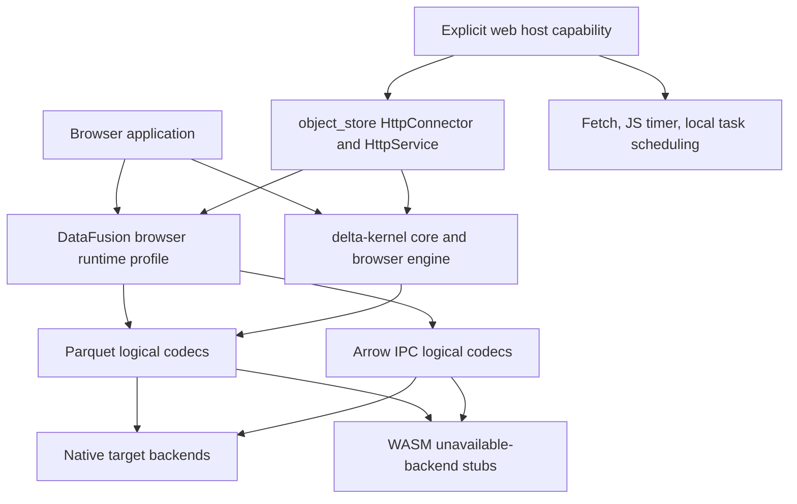

# Architecture And Ownership

## Target Contract

This design applies to the literal `wasm32-unknown-unknown` target:

```rust
all(target_arch = "wasm32", target_os = "unknown")
```

The short name `WASM_UNKNOWN` in this pack means that expression.

`target_family = "wasm"` states a broader policy. It also covers unknown-OS WASM architectures such
as `wasm64-unknown-unknown`. A project may adopt that policy after it adds matching coverage. It is
not the exact predicate for this design.

Cargo accepts an exact target dependency table for dependencies active on this target:

```toml
[target.wasm32-unknown-unknown.dependencies]
```

The codec work needs the inverse predicate so native targets retain the implementation:

```toml
[target.'cfg(not(all(
    target_arch = "wasm32",
    target_os = "unknown"
)))'.dependencies]
zstd = {
    version = "0.13",
    default-features = false,
    optional = true,
}
```

Source code uses the same predicate:

```rust
#[cfg(all(
    feature = "zstd",
    not(all(
        target_arch = "wasm32",
        target_os = "unknown"
    ))
))]
mod zstd_backend;
```

The Rust target documentation says `wasm32-unknown-unknown` imports no standard host functions,
filesystem calls return errors, and `std::thread::spawn` panics. It also states that the target does
not reveal whether JavaScript is present. See the
[`wasm32-unknown-unknown` target guide](https://doc.rust-lang.org/rustc/platform-support/wasm32-unknown-unknown.html).

## Cargo Model

Cargo unions features enabled for the same package. A consumer that disables defaults cannot prevent
another graph edge from enabling them. Cargo therefore requires additive features, and the owning
crate must remain valid under feature unification.

Resolver v2 helps with target-specific dependencies. Features from a dependency declaration that is
inactive for the selected target do not join the active target graph. Resolver v2 does not make an
ordinary optional dependency target-aware.

Primary references:

- [Cargo feature unification](https://doc.rust-lang.org/cargo/reference/features.html#feature-unification)
- [Cargo resolver v2](https://doc.rust-lang.org/cargo/reference/features.html#feature-resolver-version-2)
- [Platform-specific dependencies](https://doc.rust-lang.org/cargo/reference/specifying-dependencies.html#platform-specific-dependencies)
- [Rust conditional compilation](https://doc.rust-lang.org/reference/conditional-compilation.html)

## Logical Feature And Backend State

A codec has two independent inputs:

```text
logical feature enabled?
        |
        +-- no  --> feature-disabled error
        |
        +-- yes --> backend available for target?
                         |
                         +-- yes --> construct codec
                         |
                         +-- no  --> target-unavailable error
```

This model avoids mutually exclusive public backend features. Users ask for the wire-format
capability, such as `zstd`. The crate chooses the qualified backend for the target.

## End-To-End Architecture



The `web` feature selects browser-host services. The target predicate selects code that can exist on
the target. These choices are related but not interchangeable.

## Layer Contracts

### Arrow And Parquet

- Public codec feature names describe logical wire-format support.
- Native targets retain the existing implementation and default composition.
- `WASM_UNKNOWN` omits C-backed implementations from the active graph.
- Readers may inspect metadata before requesting a compressed body.
- Writers fail before compressed bytes enter the output sink.

### `object_store`

- `HttpConnector` and `HttpService` remain the transport seam.
- `http-base` contains host-neutral request, response, retry-policy, and object-store logic.
- `web` selects Fetch bridging, a browser timer, local task scheduling, and browser entropy if a
  call site requires it.
- The existing reqwest-on-WASM adapter remains the built-in Fetch implementation.
- Filesystem and native crypto implementations remain inactive on `WASM_UNKNOWN`.

### DataFusion

- The `datafusion` and `datafusion-common` manifests own an explicit Parquet feature list.
- `datafusion-physical-plan` retains explicit `arrow-ipc/lz4,zstd` ownership for spill formats.
- Native codec dependencies use target-specific declarations.
- Browser execution starts with disk disabled and one partition.

### Delta

- `delta_kernel` core remains engine-neutral.
- `delta_kernel_default_engine` remains native.
- A browser engine provides async object access and host services outside the default engine.
- delta-rs pins the exact kernel revision used by browser smoke tests.

## Feature Profiles

| Crate or layer | Feature       | Contract on `WASM_UNKNOWN`                                                                                          |
| -------------- | ------------- | ------------------------------------------------------------------------------------------------------------------- |
| `parquet`      | `zstd`        | Logical feature compiles; first codec construction returns unavailable-backend until a pure-Rust decoder qualifies. |
| `arrow-ipc`    | `zstd`        | Logical feature compiles; compressor and decompressor return unavailable-backend.                                   |
| `object_store` | `http-base`   | No JavaScript, OS entropy, filesystem, or Tokio runtime required.                                                   |
| `object_store` | `web`         | Browser Fetch bridge, timer, local tasks, and scoped JS entropy.                                                    |
| `object_store` | `reqwest`     | Built-in reqwest connector; browser behavior uses reqwest's Fetch backend.                                          |
| `object_store` | `http`        | Built-in HTTP profile; it may imply `web` on the browser target while preserving native behavior.                   |
| DataFusion     | `parquet`     | Explicit codec and integration list; no reliance on Parquet's evolving defaults.                                    |
| DataFusion     | `compression` | Pure backends remain active; native zstd and xz implementations become target-selected.                             |

## Design Boundaries

Upstream code must not know about Axon descriptors, Daxis, a particular CDN, delta-rs forks, or a
specific browser application. Upstream interfaces describe codecs, HTTP services, timers, task
scheduling, and engine behavior.

Axon remains responsible for:

- signed and brokered object access;
- cache identity and query budgets;
- product support policy and native fallback;
- worker topology and browser packaging.
