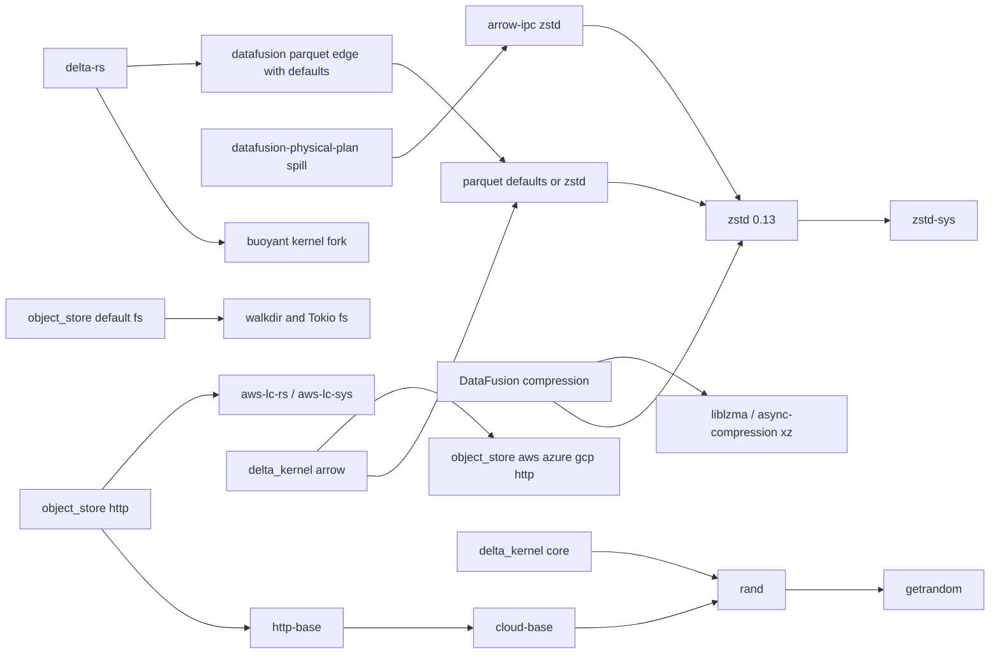

# Dependency Graph And Failure Map

## Graph

## Blocker Map

Evidence terms:

- `reproduced`: the pinned probe failed or passed in the recorded environment;
- `source-confirmed`: the pinned manifest or code contains the edge or runtime call;
- `inferred`: the consequence follows from source and platform behavior but lacks a focused probe;
- `future risk`: the edge compiles in the snapshot but violates the desired support boundary.

| Owning crate                  | Enabling edge                                            | Dependency or assumption                                | Relationship                                        | Failure phase                                 | Evidence                       | Disposition                                                                                                        |
| ----------------------------- | -------------------------------------------------------- | ------------------------------------------------------- | --------------------------------------------------- | --------------------------------------------- | ------------------------------ | ------------------------------------------------------------------------------------------------------------------ |
| `parquet`                     | default feature set includes `zstd`                      | `zstd 0.13 -> zstd-sys`                                 | Direct logical feature, transitive native backend   | Build script / C toolchain                    | Reproduced                     | Move `zstd` dependency under inverse `WASM_UNKNOWN`; compile a target-unavailable branch.                          |
| `arrow-ipc`                   | `zstd` feature                                           | `zstd 0.13 -> zstd-sys`                                 | Direct optional dependency                          | Build script / C toolchain                    | Reproduced                     | Apply the same target-selected backend model to contexts, reader, and writer.                                      |
| `parquet`                     | `#[cfg(any(feature = "zstd", test))]`                    | zstd module selected by `cfg(test)`                     | Test-only source gate                               | Rust compilation after dependency removal     | Source-confirmed               | Gate test backends by logical enablement and target availability; target-gate the dev dependency.                  |
| `parquet`                     | `brotli`, `snap`, `flate2-zlib-rs`, `lz4`                | Rust implementations in the pinned graph                | Direct optional dependencies                        | None in focused check                         | Reproduced pass                | Keep enabled on WASM and add browser golden fixtures.                                                              |
| `object_store`                | default `fs`                                             | `walkdir`, Tokio filesystem, platform deps              | Direct default features                             | Graph hygiene; runtime filesystem errors      | Source-confirmed, future risk  | Preserve native default; target-gate implementation deps and return `NotSupported` on WASM use.                    |
| `object_store`                | `http-base -> cloud-base`                                | `rand -> getrandom`                                     | Direct feature edge, transitive entropy backend     | Rust compilation / backend selection          | Reproduced                     | Remove mandatory host RNG from base retry jitter.                                                                  |
| `object_store`                | `http`                                                   | `aws-lc-rs -> aws-lc-sys`                               | Direct feature edge, transitive native crypto       | Build script / target support                 | Reproduced                     | Preserve logical native feature composition; make the dependency and source references inactive on `WASM_UNKNOWN`. |
| `object_store`                | provider batteries                                       | `ring`, crypto and random backends                      | Transitive provider implementation                  | Toolchain and random-backend exposure         | Source-confirmed               | Keep out of generic browser HTTP; test selected providers under a separate policy.                                 |
| `object_store`                | retry backoff                                            | default thread RNG and Tokio sleep                      | Direct runtime assumption                           | Rust compilation for entropy; runtime reactor | Source-confirmed               | Inject jitter and sleep services; use deterministic or zero jitter without a host source.                          |
| `object_store`                | multipart execution                                      | Tokio `JoinSet`                                         | Direct runtime assumption                           | Runtime executor / task scheduling            | Source-confirmed               | Add browser-local task scheduling without changing the public error enum.                                          |
| DataFusion `datafusion`       | direct Parquet dependency uses `default-features = true` | Parquet default codecs, including zstd                  | Direct edge causing feature unification             | Build script through `zstd-sys`               | Source-confirmed               | Set defaults off and name the Parquet features DataFusion promises.                                                |
| `datafusion-common`           | direct Parquet dependency uses `default-features = true` | Parquet default codecs                                  | Direct edge causing feature unification             | Build script through `zstd-sys`               | Source-confirmed               | Use the same explicit feature list.                                                                                |
| `datafusion-physical-plan`    | explicit `arrow-ipc` features `lz4,zstd`                 | Arrow IPC zstd backend                                  | Direct feature ownership                            | Build script through `zstd-sys`               | Source-confirmed               | Keep the edge; Arrow IPC must make it target-safe.                                                                 |
| DataFusion `datafusion`       | default `compression`                                    | direct `zstd`, `liblzma`; datasource compression        | Direct optional dependencies                        | Build script / C toolchain                    | Source-confirmed               | Keep logical compression; split native dependency implementations by target.                                       |
| `datafusion-datasource`       | `async-compression` features `xz,zstd`                   | xz and zstd backend graph                               | Direct optional dependency features                 | Build script / C toolchain                    | Source-confirmed               | Use target-specific dependency feature lists and target-unavailable operation errors.                              |
| DataFusion runtime            | disk manager, spill, `tempfile`, Tokio scheduling        | filesystem and executor assumptions                     | Direct runtime behavior                             | Runtime error or panic                        | Source-confirmed               | Publish and test the no-disk, one-partition browser tier.                                                          |
| `delta_kernel`                | mandatory `rand 0.9`                                     | `getrandom 0.3`                                         | Direct dependency, transitive entropy backend       | Rust compilation / backend selection          | Reproduced                     | Classify each random use; gate write-only paths or route them through an existing engine service.                  |
| `delta_kernel`                | `arrow-58` or `arrow-59`                                 | Parquet defaults plus `object_store` provider batteries | Direct feature, transitive codec and provider graph | Build script and Rust compilation             | Reproduced in downstream graph | Make Arrow integration target-safe while keeping the default engine separate.                                      |
| `delta_kernel_default_engine` | native default features                                  | Tokio multi-thread runtime, reqwest TLS, UUID v4        | Direct native engine dependencies                   | Runtime and target support                    | Source-confirmed               | Keep the crate native; add a separate browser engine.                                                              |
| delta-rs                      | `buoyant/main` git dependencies                          | moving kernel fork                                      | Direct git dependency                               | Resolution and provenance                     | Source-confirmed               | Pin the exact fork revision in CI and test an upstream-kernel patch in a separate smoke.                           |
| Browser deployment            | cross-origin Fetch                                       | CORS, Range, exposed headers, validators                | Host protocol                                       | Browser protocol / deployment                 | Source-confirmed               | Run a two-origin browser suite and emit qualified network-policy diagnostics.                                      |

## Native And Runtime Dependency Classification

| Dependency or class          | Finding in the pinned graph                                                                                                                    |
| ---------------------------- | ---------------------------------------------------------------------------------------------------------------------------------------------- |
| `zstd-sys`                   | Reproduced C and build-toolchain blocker from Parquet, Arrow IPC, DataFusion, and Delta feature paths.                                         |
| `aws-lc-sys`                 | Reproduced target and build-script exposure from the `object_store/http` batteries.                                                            |
| `getrandom`                  | Reproduced backend-selection blocker through `rand` in `object_store`, DataFusion, and delta-kernel paths.                                     |
| `brotli`                     | The focused Parquet WASM check passed; no C-backed blocker was observed.                                                                       |
| `hyper`                      | `object_store/cloud-base` enables it, but the focused failure came from entropy. Keep host-neutral HTTP types if used; target-gate native I/O. |
| Tokio `rt`, `time`, and `fs` | These features can compile while retry, spill, filesystem, or executor calls fail at runtime. Remove them from host-neutral base contracts.    |
| `async-compression`          | Its pinned DataFusion feature list selects zstd and xz backends. A WASM target declaration can retain bzip2 and gzip without those backends.   |
| `ring`                       | Provider batteries expose crypto, entropy, and toolchain concerns. No blanket C or assembly failure claim is made for the pinned version.      |
| `walkdir` and `tempfile`     | Treat as graph-hygiene and runtime-support failures unless a focused target check proves a compiler failure.                                   |

## Feature-Unification Findings

Cargo feature unification creates three important paths:

1. DataFusion's defaults-on Parquet edges restore Parquet defaults even though the workspace
   declaration disables them.
2. DataFusion spill support enables `arrow-ipc/zstd` in every graph that contains
   `datafusion-physical-plan`.
3. A Delta or DataFusion consumer can re-enable a logical codec feature that another dependency tried
   to suppress.

Parquet and Arrow IPC therefore own compile safety. DataFusion owns direct-feature hygiene. A
defaults-off declaration in delta-rs or Axon cannot substitute for either fix.

## Blockers Excluded From The Current Claim

- The pinned Parquet checks passed with `snap`, `brotli`, `flate2-zlib-rs`, and `lz4`.
- [`bzip2` 0.6](https://github.com/trifectatechfoundation/bzip2-rs) selects the Rust
  `libbz2-rs-sys` backend by default. A C backend remains opt-in, and the current DataFusion feature
  set does not select it.
- `ring` should not appear in the generic browser HTTP fixture. This pack does not claim that every
  `ring` version fails due to C or assembly on this target.
- Filesystem crates that compile behind source `cfg` remain graph-hygiene and runtime-support risks
  unless a focused compiler failure proves more.
